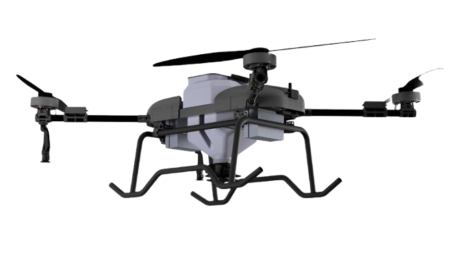

---
hide:
  - navigation
  - toc
---

  

    <h1>About Us</h1>
    

      We are a passionate team committed to transforming the world through innovative drone and robotics technologies. With a forward-thinking mindset, we push the limits of what’s possible in autonomous systems.Our mission is to deliver practical, high-impact solutions for sectors like defense, agriculture, and industry shaping a smarter and more efficient future through bold ideas and agile thinking.
    

    

      <a href="md/jetson/" class="md-button md-button--primary">Jetson</a>
      <a href="md/raspberry/" class="md-button">Raspberry Pi</a>
      <a href="#About Us" class="md-button md-button--ghost">Quickstart</a>
    

  

  

    <h2>Lectron Jetson AutoPilot Systems</h2>
    
Meet our specialized Indoor Surveillance Drone, engineered for precision monitoring in confined and indoor environments.

    <ul>
      <li>Imaging & provisioning</li>
      <li>systemd services & boot modules</li>
      <li>I/O patterns (GPIO/SPI/I2C/UART)</li>
      <li>Stability and monitoring</li>
    </ul>
  

  

    
  

  

    <h2>Lectron ARI</h2>
    
Fully Autonomous Kamikaze UAV
Meet our specialized Indoor Surveillance Drone, engineered for precision monitoring in confined and indoor environments. Whether it’s for security, inspections, or tactical applications, this compact drone delivers superior performance and maneuverability where traditional drones cannot operate. Operational Capabilities of Fully Autonomous Kamikaze UAVs

  

  

    
  

  

    <h2>Lectron EBABIL-5</h2>
    
Lectron Ebabil can carry up to a 5 kg payload and be equipped with various gimbals. Ebabil is optimized for surveillance, reconnaissance, and precision bomb-dropping missions, offering versatility and precision in a wide range of operational scenarios.

  

  

    
  

  

    <h2>Lectron EBABIL</h2>
    
Introducing our powerful Heavy-Duty Logistics Drone, designed to revolutionize transportation and delivery solutions. Built for strength and reliability, this drone offers an impressive 75 kg payload capacity, making it ideal for industrial, commercial, and emergency applications where heavy cargo needs to be delivered efficiently.

  

  

    
  

