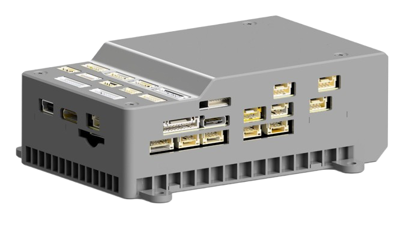
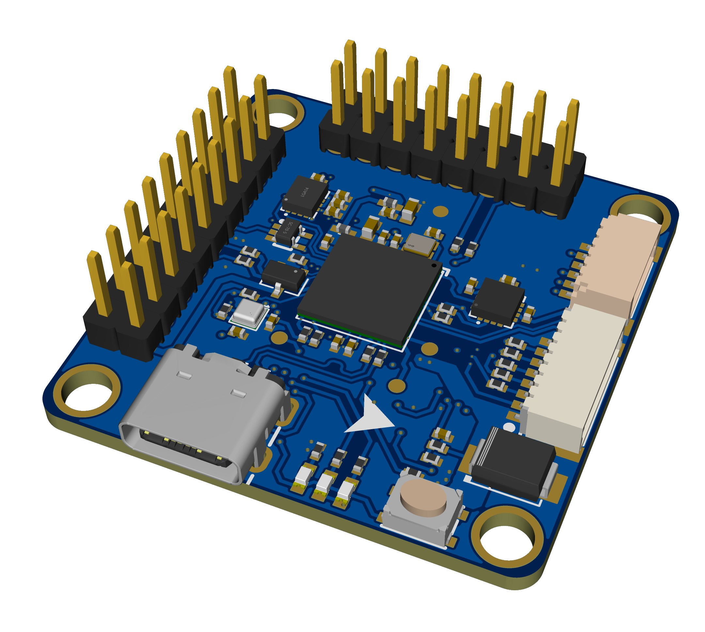
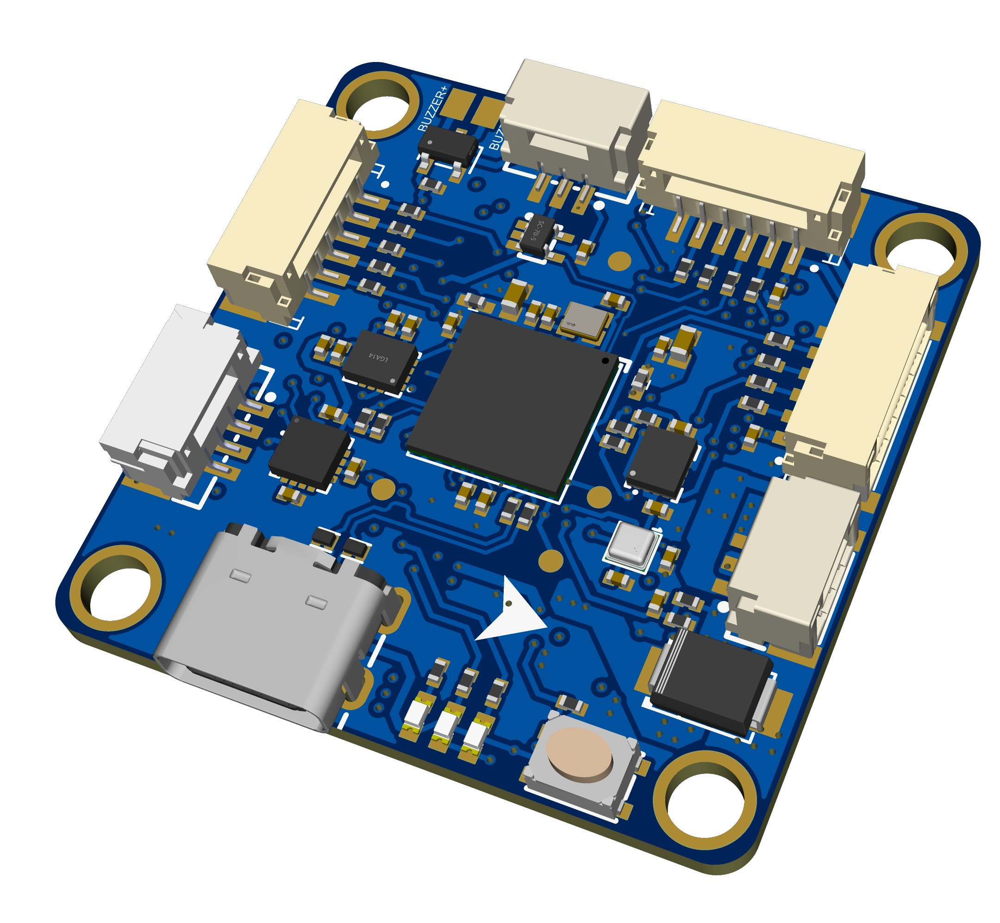

---
hide:
  - navigation
  - toc
---

  

    <h1>Welcome to Lectron Documentation</h1>
    

      This documentation will help you understand Lectron's autopilot products - technical specifications, pinouts, block diagrams, assembly guides, software setup, and integration tutorials.
    

    

      Questions or feedback? Contact us at <a href="mailto:contact@lectrontech.com">contact@lectrontech.com</a>
    

  

  

    <h2>Lectron Jetson Autopilot</h2>
    <ul>
      <li>Jetson Nano / Xavier NX / TX2 NX support</li>
      <li>Onboard Ethernet switch, dual CSI camera, CAN, UART, GPIO</li>
      <li>Processor: STM32H753 FMU + STM32F103 IO</li>
      <li>IMU: Dual ICM-42670-P & Bosch BMI270</li>
      <li>Barometer: Dual Bosch BMP390</li>
      <li>Magnetometer: Bosch BMM350</li>
      <li>Dimensions: 63.4 × 103.5 × 43.6 mm (case, excl. fan module)</li>
      <li>Weight: 224.4 (without Jetson)</li>
    </ul>
  

  

    
  

  

    <h2>Lectron Pi5 Autopilot</h2>
    <ul>
      <li>Raspberry Pi Compute Module 5</li>
      <li>Optional Hailo-8 edge AI accelerator</li>
      <li>RealSense camera support, CM5 GPIO, FMU ↔ CM5 comms</li>
      <li>Processor: STM32H753 FMU + STM32F103 IO</li>
      <li>IMU: Dual ICM-42670-P & Bosch BMI270</li>
      <li>Barometer: Dual Bosch BMP390</li>
      <li>Magnetometer: Bosch BMM350</li>
      <li>Dimensions: 67.1 × 118.9 × 30.1 mm (case, excl. fan module)</li>
      <li>Weight: 147.6 (without CM5)</li>
    </ul>
  

  

    
  

  

    <h2>Lectron FPV</h2>
    <ul>
      <li>USB-C programming/debug port</li>
      <li>Processor: STM32H743 FMU</li>
      <li>IMU: ICM-42688-P</li>
      <li>Barometer: BMP581</li>
      <li>Magnetometer: IST8310</li>
      <li>Dimensions: 36 × 36 mm</li>
    </ul>
  

  

    
  

  

    <h2>Lectron FPV Pro</h2>
    <ul>
      <li>USB-C programming/debug port</li>
      <li>Processor: STM32H743</li>
      <li>IMU: ICM-42688-P & LSM6DSV16BXTR</li>
      <li>Barometer: BMP581</li>
      <li>Magnetometer: IST8310</li>
      <li>Dimensions: 36 × 36 mm </li>
    </ul>
  

  

    
  

