# Assembly Guide

This guide walks through assembling the **Lectron Jetson Autopilot** — mounting the Jetson module, connecting the sensor board, and installing the enclosure and fans.

## **What's in the Box**

Before starting, make sure you have all of the following components:

| # | Component |
| :-: | :-------- |
| 1 | Bottom case (heatsink) |
| 2 | Top case |
| 3 | Bottom case plate |
| 4 | IMU board |
| 5 | Lectron Baseboard |
| 6 | Power board |
| 7 | Lectron V6X Module |
| 8 | Jetson module |
| 9 | IO Expansion board |
| 10 | Fan (×2) |
| 11 | Fan guard |
| 12 | 4 pcs M2.5x25 mm screws |
| 13 | 11 pcs M2×6 mm screws |
| 14 | 8 pcs M2×4 mm screws |
| 15 | 6 pcs M2×12 mm screws |

---

## **Step 1 — Mount the Lectron V6X**

!!! danger "Handle with Care"
    Before mounting, verify the alignment carefully. Once confirmed, press the module down gently and evenly. Forcing a misaligned module may permanently damage the flight controller connectors.

Align the Lectron V6X board over the baseboard using the four mounting holes (**1–4**) and press it down until it seats onto the connectors.

---

## **Step 2 — Mount the Power Module and IO Expansion Module**

Two add-on modules attach to the top of the baseboard in the positions marked by the numbered labels:

- **Top right** — Power module, aligned to positions **1**, **2** and **3**
- **Bottom right** — IO expansion module, aligned to positions **4** and **5**

Seat each module in order, following the numbering on the board.

Once both modules are seated correctly, the assembly should look like this:

---

## **Step 3 — Fasten the Modules**

Secure the Power module, IO expansion module, and FMU module to the baseboard using the supplied **M2×6 mm screws**. Tighten all screw positions marked in the diagram below.

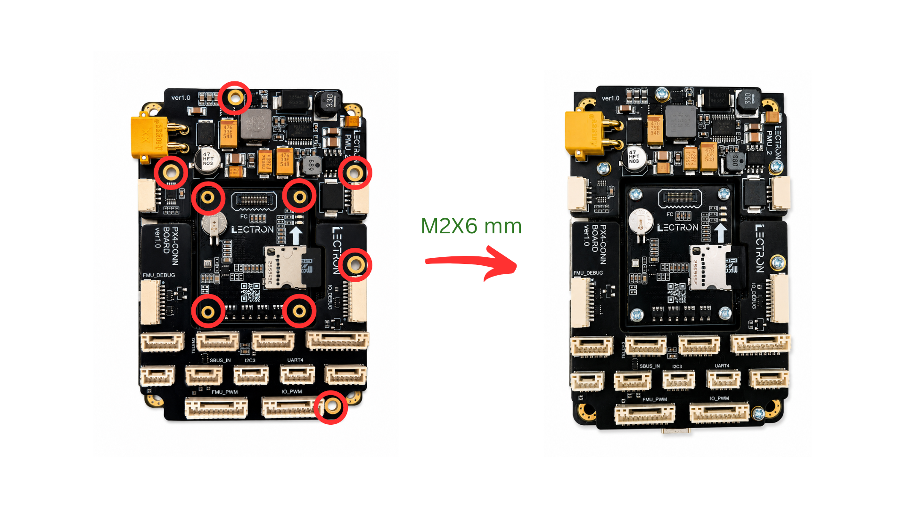

!!! note "FMU Mounting Holes"
    The FMU mounting holes are intentionally tight with the supplied screws. This is by design to ensure a secure, rattle-free fit.

---

## **Step 4 — Install the Jetson Module**

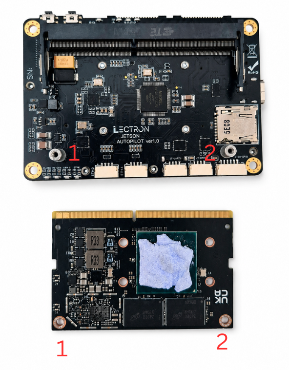

!!! warning "Apply the Thermal Pad"
    The thermal pad must be attached to the Jetson module before closing the case. Operating without it will cause the module to overheat.

Insert the Jetson module into the SODIMM connector at approximately **45°**, engaging the edge connector first.

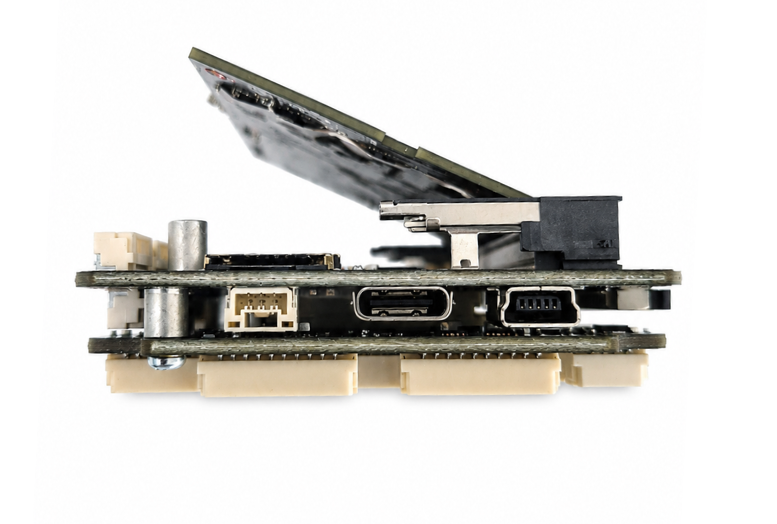

!!! danger "Handle the Connector with Care"
    Insert the module at the correct angle and never force it. Misalignment at this stage may damage the SODIMM connector on the baseboard.

Once the connector is engaged, press the module down flat. Hold the module flat and secure it with the two supplied **M2×6 mm screws** at the positions marked in the image.

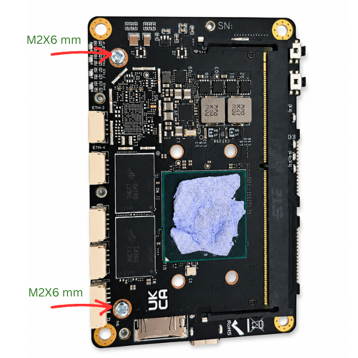

---

## **Step 5 — Assemble Bottom Plate**

Place the bottom case plate onto the bottom case and fasten it using the supplied **M2×4 mm screws** at the four corner positions as shown.

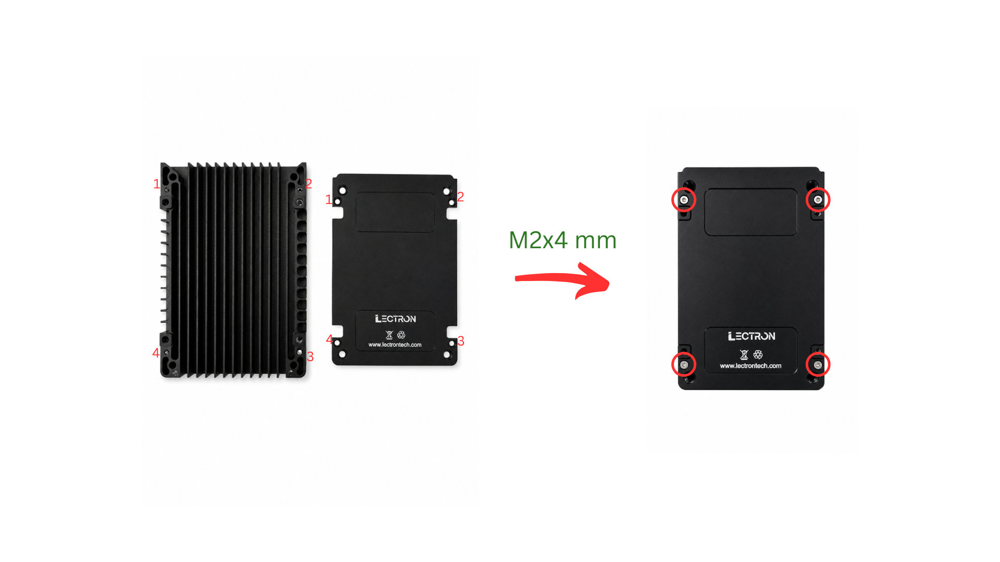

!!! Warning "Plate Orientation"
    The bottom case is **not symmetric**. Make sure the plate is oriented correctly before fastening. Incorrect orientation will block airflow.

---

## **Step 6 — Place the Board Stack into the Bottom Case**

Lower the assembled board stack into the bottom case, aligning the four corners (**1–4**) with the case standoffs. Use the **notch on the top edge of the case** (highlighted by the yellow rectangle) as an orientation reference to ensure the board is placed the correct way around.

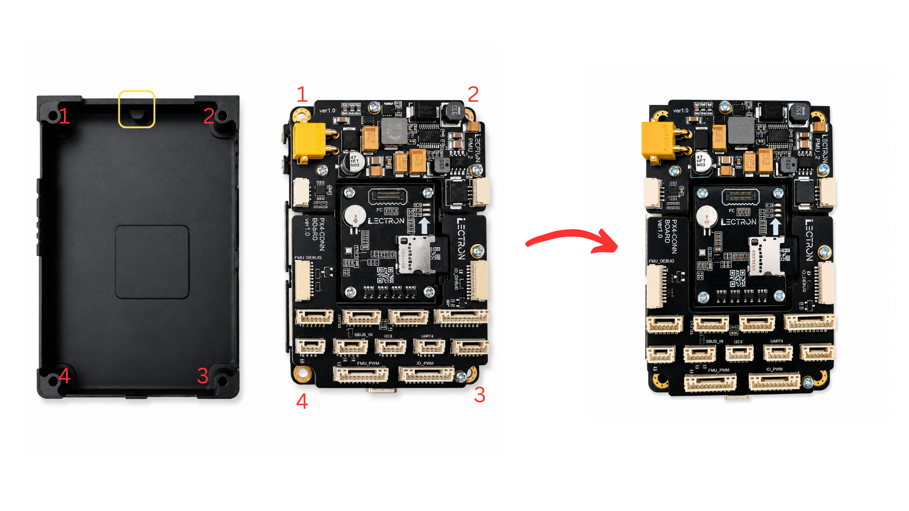

Once seated correctly, the assembly should look like this:

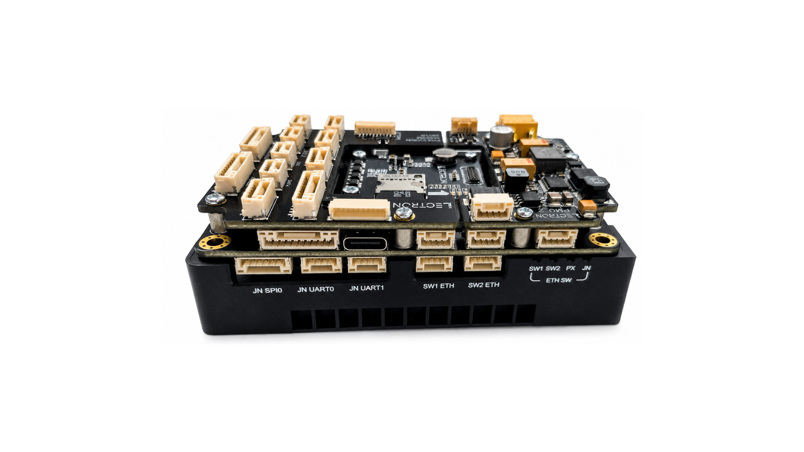

---

## **Step 7 — Case Assemble**

Lower the top case over the board stack, aligning the connector cutouts with the board's ports. Press it down gently until it sits flush with the bottom case.

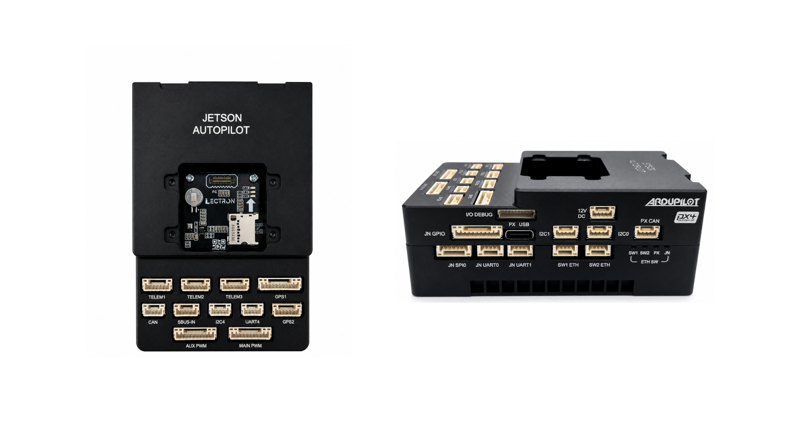

Flip the assembly over and fasten the top case to the bottom case using the four supplied **M2.5×25 mm screws** through the holes at each corner as shown.

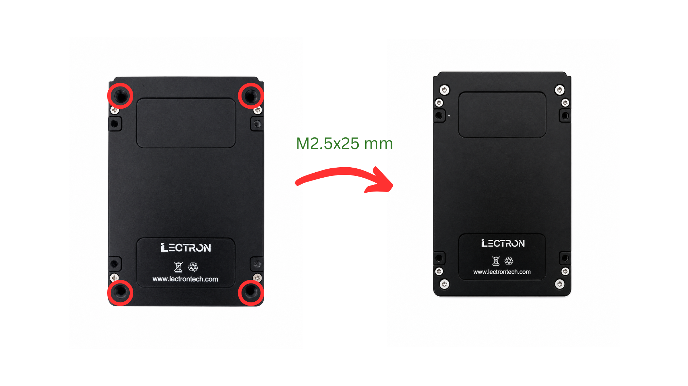

---

## **Step 8 — Install the Cooling Fans**

The thermal fan system consists of the top case with integrated air ducts, two blower fans, and the fan guard.

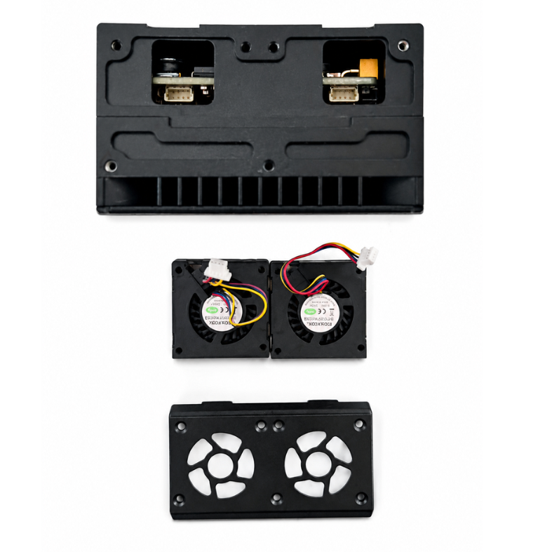

**1. Connect the fan cables**

Before placing the fans, connect each fan's cable to the corresponding connector on the top case (shown by the green boxes in the left image). Use tweezers or a similar tool to seat the connectors fully.

Route the fan cables into the empty space above the connectors so they do not obstruct the fans.

!!! warning "Handle Fan Cables with Care"
    Fan cables are fragile and can detach from the fan body if pulled or bent sharply. Handle them with care and avoid applying tension to the cable near the fan housing.

**2. Place the fans**

Set each fan into its bay on the top case. The **exhaust side** of the fan (the flat, outlet face — highlighted by the green box in the center image) must face toward the **air duct of the bottom case**. The **intake side** (the visible impeller) must face inward toward the board to draw air across it.

**3. Attach the fan guard**

Place the fan guard over the fans and fasten it using the supplied **M2×12 mm screws** at the positions shown in the right image.

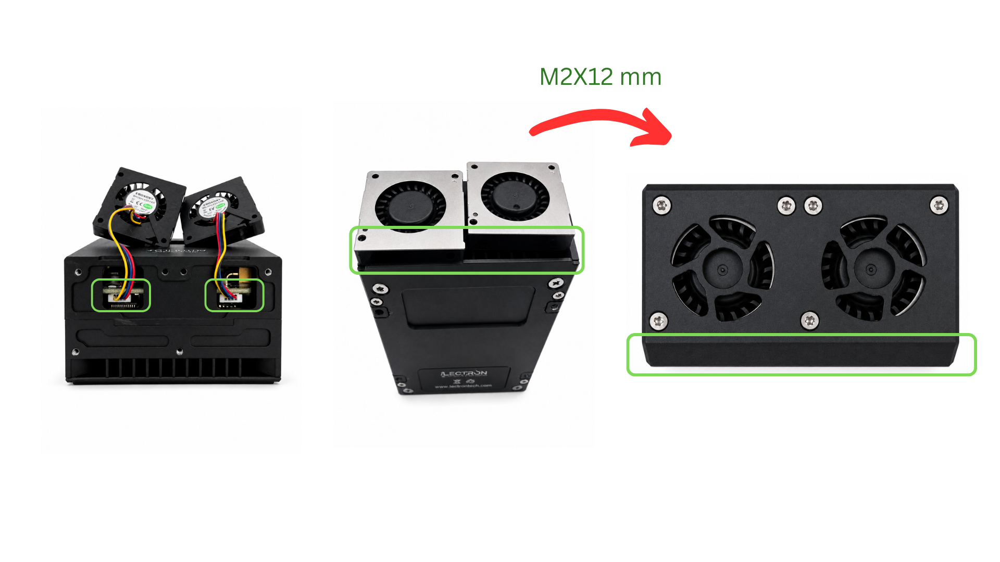

## **Step 9 — Install the IMU Board**

Connect the flex cable of the IMU board to shown connector and place it onto the top case.

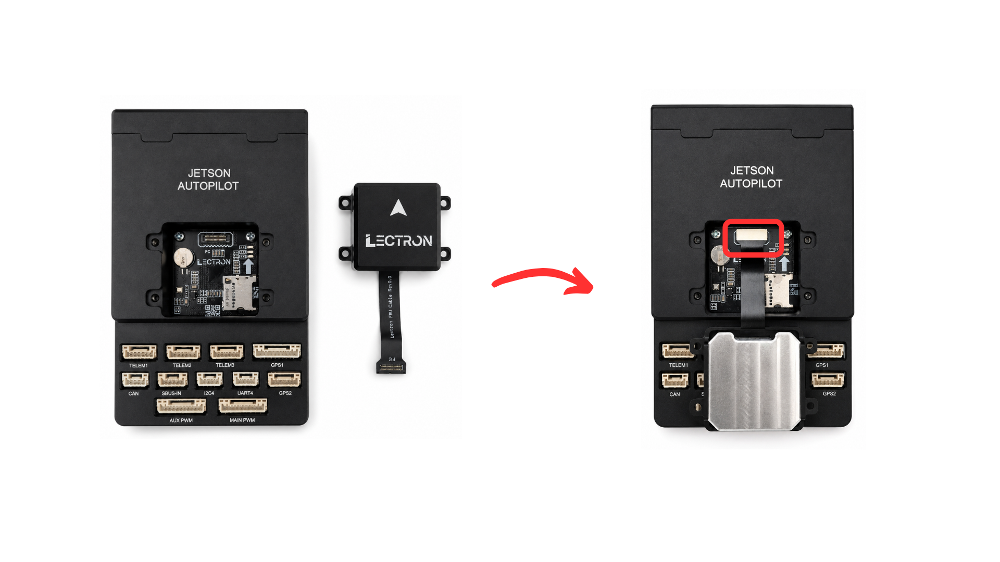

!!! danger "Handle the Flex Cable with Care"
    Insert the flex cable gently and straight into the connector. Do not bend, pull, or force it — the cable and connector are fragile and can be permanently damaged with excessive force.

Secure the IMU board to the case using the four supplied **M2×4 mm screws** at the corner holes as shown.

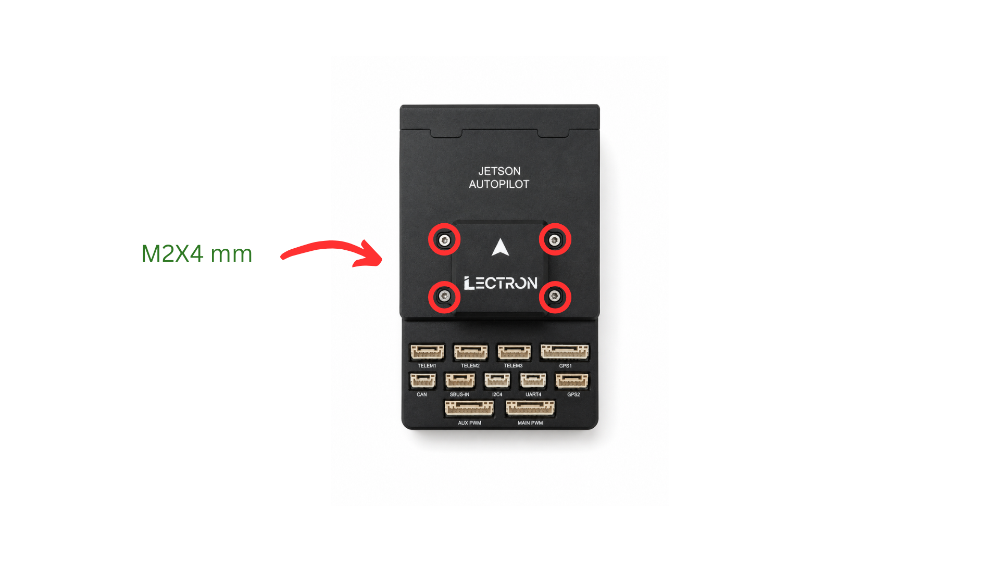

!!! tip "Assembly Complete"
    The Lectron Jetson Autopilot is now fully assembled. Continue with the [Initial Installation](setup.md) guide to flash the Jetson module and FMU firmware.
