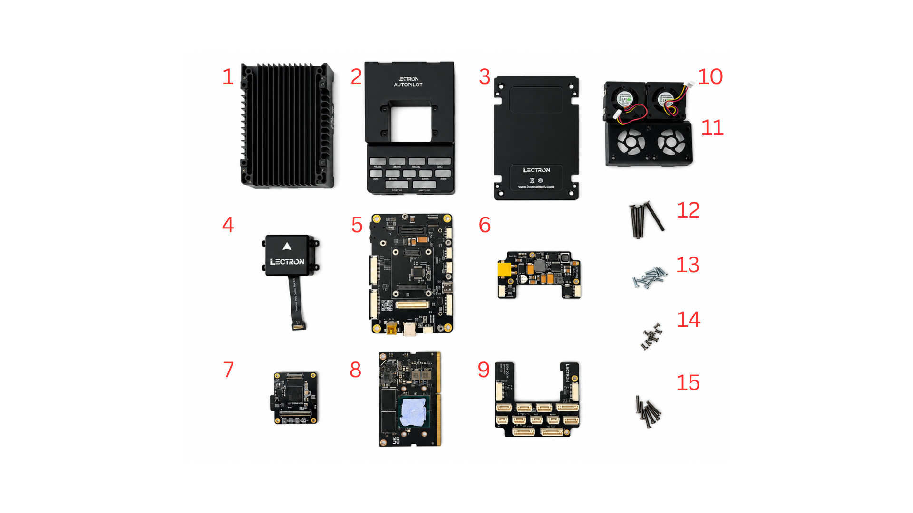
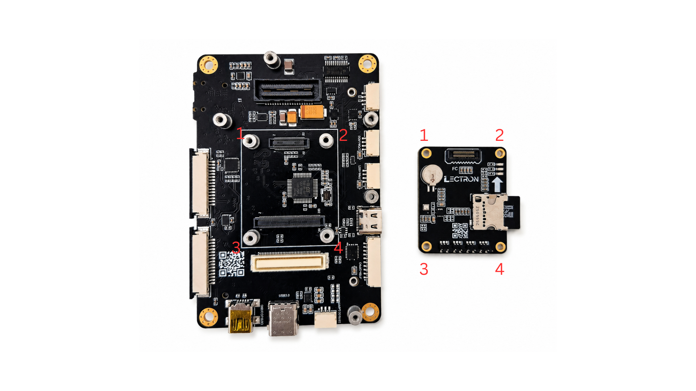
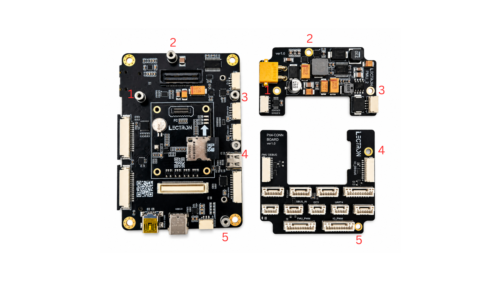
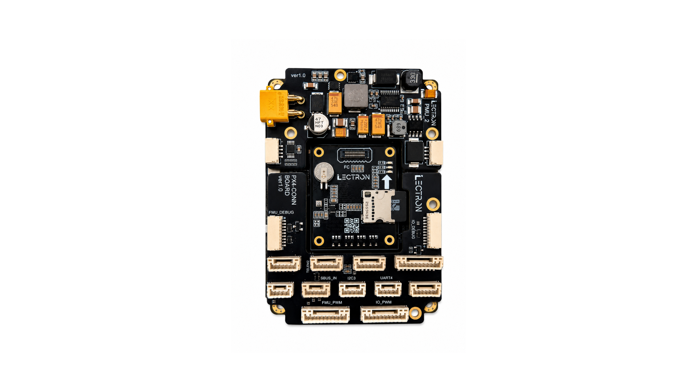

# Assembly Guide

This guide walks through assembling the **Lectron Jetson Autopilot** — mounting the Jetson module, connecting the sensor board, and installing the enclosure and fans.

## **What's in the Box**

Before starting, make sure you have all of the following components:

| # | Component |
| :-: | :-------- |
| 1 | Bottom case (heatsink) |
| 2 | Top case |
| 3 | Bottom case plate |
| 4 | IMU board |
| 5 | Lectron Baseboard |
| 6 | Power board |
| 7 | Lectron V6X Module |
| 8 | Jetson module |
| 9 | IO Expansion board |
| 10 | Fan (×2) |
| 11 | Fan guard |
| 12 | 4 pcs M2.5x20 mm screws |
| 13 | 11 pcs M2×6 mm screws |
| 14 | 8 pcs M2×4 mm screws |
| 15 | 6 pcs M2×12 mm screws |

---

## **Step 1 — Mount the Lectron V6X**

!!! danger "Handle with Care"
    Before mounting, verify the alignment carefully. Once confirmed, press the module down gently and evenly. Forcing a misaligned module may permanently damage the flight controller connectors.

Align the Lectron V6X board over the baseboard using the four mounting holes (**1–4**) and press it down until it seats onto the connectors.

---

## **Step 2 — Mount the Power Module and IO Expansion Module**

Two add-on modules attach to the top of the baseboard in the positions marked by the numbered labels:

- **Top right** — Power module, aligned to positions **2** and **3**
- **Bottom right** — IO expansion module, aligned to positions **4** and **5**

Seat each module in order, following the numbering on the board.

Once both modules are seated correctly, the assembly should look like this:

---

*More assembly steps will be added as the guide is completed.*
