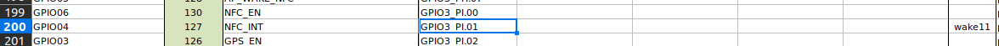

# GPIO Control

## **JN GPIO Port**

### **Jetson Nano**


The Jetson GPIO signals are routed through a bidirectional level shifter before reaching the external GPIO connector. The level shifter translates between the Jetson's **1.8V** I/O domain and the connector-side **3.3V** domain.

| Connector Pin | Signal  | Jetson SODIMM Pin | GPIO Identifier | Sysfs # |
|:---:|---------|:-----------------:|-----------------|:-------:|
| 1   | VDD_5V_SYS | —             | Power           | —       |
| 2   | GPIO00  | 87                | GPIO3_PCC.04    | **228** |
| 3   | GPIO01  | 118               | GPIO3_PS.05     | **149** |
| 4   | GPIO02  | 124               | GPIO3_PH.06     | **62**  |
| 5   | GPIO03  | 126               | GPIO3_PI.02     | **66**  |
| 6   | GPIO05  | 128               | GPIO3_PH.07     | **63**  |
| 7   | GPIO07  | 206               | GPIO3_PV.00     | **168** |
| 8   | GPIO10  | 212               | GPIO3_PV.01     | **169** |
| 9   | GPIO11  | 216               | GPIO3_PZ.00     | **200** |
| 10  | GND     | —                 | —               | —       |

## **Jetson Xavier NX**

Same external GPIO connector and level shifter as the Nano variant: the Jetson's **1.8V** I/O is translated to the connector-side **3.3V** domain. Note the GPIO identifiers and sysfs numbers differ from the Nano because the Xavier NX uses a different SoC and pin map.

| Connector Pin | Signal  | SoC Signal      | GPIO Identifier | Sysfs # |
|:---:|---------|-----------------|-----------------|:-------:|
| 1   | VDD_5V_SYS | —            | Power           | —       |
| 2   | GPIO00  | USB_VBUS_EN0    | GPIO3_PZ.01     | **489** |
| 3   | GPIO01  | SOC_GPIO41      | GPIO3_PQ.05     | **421** |
| 4   | GPIO02  | SOC_GPIO23      | GPIO3_PQ.03     | **419** |
| 5   | GPIO03  | SPI2_SCK        | GPIO3_PCC.00*   | **264** |
| 6   | GPIO05  | SPI2_MOSI       | GPIO3_PCC.02*   | **266** |
| 7   | GPIO07  | SOC_GPIO44      | GPIO3_PR.00     | **424** |
| 8   | GPIO10  | SOC_GPIO21      | GPIO3_PQ.01     | **417** |
| 9   | GPIO11  | SOC_GPIO42      | GPIO3_PQ.06     | **422** |
| 10  | GND     | —               | —               | —       |

!!! note "AON GPIO Logic"
    GPIO03 and GPIO05 (marked with *) are on the always-on (AON) controller and have inverted logic — write `0` to drive high, write `1` to drive low.


!!! note "Level Shifter"
    GPIO pins on this connector operate at **3.3V**. Do not apply 5V directly to any GPIO pin.

---

## **What is `sysfs`?**
Linux exposes hardware interfaces under `/sys` using a special virtual filesystem called sysfs.
GPIO, PWM, I2C, SPI and other hardware components appear as simple files inside this structure.

!!! note "Info"
    This allows GPIO pins to be controlled using simple file writes:  **`export → direction → value`**.

!!! example "Terminal Code Example"
    This example demonstrates how to set GPIO with sysfs ID **228** (GPIO00) to HIGH and LOW using the terminal.

    ```bash
    echo 228 > /sys/class/gpio/export
    echo out > /sys/class/gpio/gpio228/direction
    echo 1 > /sys/class/gpio/gpio228/value
    echo 0 > /sys/class/gpio/gpio228/value
    ```

## **How to Calculate the Sysfs Value from a GPIO Name?**

- Download the pinmux configuration file for your specific Jetson module. It is available on NVIDIA's official [documentation page](https://developer.nvidia.com/embedded/downloads).
- Inside the downloaded `pinmux_config_template.xlsm` file, you will find two sheets:
    - The first sheet contains general notes and explanations.
    - The second sheet (**jetson_[xx]_module**) lists the GPIO names along with their detailed identifiers (e.g., `GPIO3_PI.01`).



- In an identifier such as `GPIO3_PI.01`:
    - The letters (e.g., PI, where **I** is important) correspond to the `TEGRA_GPIO_PORT` value.
    - The number after the dot (`01`) represents the pin **offset**.
- The Sysfs GPIO number is computed using the following formula: `TEGRA_GPIO = (TEGRA_GPIO_PORT * 8) + pin_offset`
    - You can find this formula in the `tegra194-gpio.h` header file.

```c title="tegra194-gpio.h" hl_lines="1"
#define TEGRA_GPIO(port, offset) \ ((TEGRA_GPIO_PORT_##port * 8) + offset)
#define TEGRA_GPIO_PORT_A   0
#define TEGRA_GPIO_PORT_B   1
#define TEGRA_GPIO_PORT_C   2
#define TEGRA_GPIO_PORT_D   3
#define TEGRA_GPIO_PORT_E   4
#define TEGRA_GPIO_PORT_F   5
#define TEGRA_GPIO_PORT_G   6
#define TEGRA_GPIO_PORT_H   7
#define TEGRA_GPIO_PORT_I   8
#define TEGRA_GPIO_PORT_J   9
#define TEGRA_GPIO_PORT_K  10
#define TEGRA_GPIO_PORT_L  11
#define TEGRA_GPIO_PORT_M  12
#define TEGRA_GPIO_PORT_N  13
#define TEGRA_GPIO_PORT_O  14
#define TEGRA_GPIO_PORT_P  15
#define TEGRA_GPIO_PORT_Q  16
#define TEGRA_GPIO_PORT_R  17
#define TEGRA_GPIO_PORT_S  18
#define TEGRA_GPIO_PORT_T  19
#define TEGRA_GPIO_PORT_U  20
#define TEGRA_GPIO_PORT_V  21
#define TEGRA_GPIO_PORT_W  22
#define TEGRA_GPIO_PORT_X  23
#define TEGRA_GPIO_PORT_Y  24
#define TEGRA_GPIO_PORT_Z  25
#define TEGRA_GPIO_PORT_AA 26
#define TEGRA_GPIO_PORT_BB 27
#define TEGRA_GPIO_PORT_CC 28
#define TEGRA_GPIO_PORT_DD 29
#define TEGRA_GPIO_PORT_EE 30
#define TEGRA_GPIO_PORT_FF 31
```

- After substituting the port index and the pin offset into the formula, you obtain the corresponding sysfs GPIO number.

!!! example "Example"
        GPIO00 sysfs value is 228
        GPIO00 -> GPIO3_PCC.04
        TEGRA_GPIO_PORT = CC
        Offset = 4
        TEGRA_GPIO = (TEGRA_GPIO_PORT_CC * 8) + 4 -> (28 * 8) + 4 = 228

!!! danger "Warning"
    This Formula Does NOT Apply to PMIC GPIOs **(`max77620-gpio`)**
    ```bash
    sudo dmesg | grep "registered GPIO"
    [    0.534131] gpiochip_setup_dev: registered GPIOs 0 to 255 on device: gpiochip0 (tegra-gpio)
    [    0.591897] gpiochip_setup_dev: registered GPIOs 504 to 511 on device: gpiochip1 (max77620-gpio)
    ```

- Jetson platforms have two separate GPIO controllers:
    - **tegra-gpio** → [0–255] On-SoC Tegra GPIOs
    - **max77620-gpio** → [504–511] PMIC GPIOs
- If the GPIO belongs to tegra-gpio → Use Tegra Port Formula.
- If it belongs to max77620-gpio → The sysfs number is assigned directly by the kernel and the correct calculation is `offset = sysfs_gpio - gpiochip_base   # Example: 509 - 504 = 5`

## **GPIO Usage**
=== "C (libgpiod)"

    ```c
    #include <stdio.h>
    #include <stdlib.h>
    #include <unistd.h>
    #include <string.h>

    #define GPIO_BASE "/sys/class/gpio"

    static int gpios[] = {228, 149, 62, 66, 63, 168, 169, 200};
    static const char *names[] = {
        "GPIO00","GPIO01","GPIO02","GPIO03",
        "GPIO05","GPIO07","GPIO10","GPIO11"
    };
    #define GPIO_COUNT (sizeof(gpios) / sizeof(gpios[0]))

    static int gpio_write_file(const char *path, const char *value) {
        FILE *f = fopen(path, "w");
        if (!f) { perror(path); return -1; }
        fprintf(f, "%s", value);
        fclose(f);
        return 0;
    }

    static void export_gpio(int gpio) {
        char path[64], buf[8];

        /* Export */
        snprintf(buf, sizeof(buf), "%d", gpio);
        gpio_write_file(GPIO_BASE "/export", buf);

        /* Set direction */
        snprintf(path, sizeof(path), GPIO_BASE "/gpio%d/direction", gpio);
        gpio_write_file(path, "out");
    }

    static void unexport_gpio(int gpio) {
        char buf[8];
        snprintf(buf, sizeof(buf), "%d", gpio);
        gpio_write_file(GPIO_BASE "/unexport", buf);
    }

    static void set_value(int gpio, int value) {
        char path[64];
        snprintf(path, sizeof(path), GPIO_BASE "/gpio%d/value", gpio);
        gpio_write_file(path, value ? "1" : "0");
    }

    int main(void) {
        /* Export all */
        for (size_t i = 0; i < GPIO_COUNT; i++)
            export_gpio(gpios[i]);

        printf("Sequential blink — watch your LED bar...\n");

        for (size_t i = 0; i < GPIO_COUNT; i++) {
            printf("  ON  -> %s (gpio%d)\n", names[i], gpios[i]);
            set_value(gpios[i], 1);
            usleep(500000);   /* 500 ms */
            set_value(gpios[i], 0);
            usleep(200000);   /* 200 ms */
        }

        printf("Done. Cleaning up.\n");
        for (size_t i = 0; i < GPIO_COUNT; i++)
            unexport_gpio(gpios[i]);

        return 0;
    }
    ```
    Compile and run:
    ```bash
        gcc -o test_gpio test_gpio.c
        sudo ./test_gpio
    ```

=== "Shell (sysfs)"

    ```bash
    #!/bin/sh

    if [ $# -ne 2 ]; then
        echo "Usage: $0 <GPIO_PIN> <VALUE>"
        echo "VALUE: 0 (low) or 1 (high)"
        exit 1
    fi

    GPIO_PIN="$1"
    VALUE="$2"

    if [ "$VALUE" != "0" ] && [ "$VALUE" != "1" ]; then
        echo "Error: VALUE must be 0 or 1"
        exit 1
    fi

    GPIO_PATH="/sys/class/gpio/gpio$GPIO_PIN"

    if [ ! -d "$GPIO_PATH" ]; then
        echo "$GPIO_PIN" > /sys/class/gpio/export
        sleep 0.1
    fi

    echo "out" > "$GPIO_PATH/direction"
    echo "$VALUE" > "$GPIO_PATH/value"
    ```
    Make executable and run:
    ```bash
        chmod +x gpio_set.sh
        sudo ./gpio_set.sh 228 1
    ```


=== "Python"

    ```python
    #!/usr/bin/env python3
    import time
    import os

    GPIOS  = [228, 149, 62, 66, 63, 168, 169, 200]
    NAMES  = ["GPIO00","GPIO01","GPIO02","GPIO03",
            "GPIO05","GPIO07","GPIO10","GPIO11"]
    GPIO_BASE = "/sys/class/gpio"

    def gpio_write(gpio, filename, value):
        with open(f"{GPIO_BASE}/gpio{gpio}/{filename}", "w") as f:
            f.write(str(value))

    def export(gpio):
        export_path = f"{GPIO_BASE}/gpio{gpio}"
        if not os.path.exists(export_path):
            with open(f"{GPIO_BASE}/export", "w") as f:
                f.write(str(gpio))
        gpio_write(gpio, "direction", "out")

    def unexport(gpio):
        with open(f"{GPIO_BASE}/unexport", "w") as f:
            f.write(str(gpio))

    for gpio in GPIOS:
        export(gpio)

    print("Sequential blink — watch your LED bar...")

    try:
        for gpio, name in zip(GPIOS, NAMES):
            print(f"  ON  → {name} (gpio{gpio})")
            gpio_write(gpio, "value", 1)
            time.sleep(0.5)
            gpio_write(gpio, "value", 0)
            time.sleep(0.2)
    finally:
        print("Done. Cleaning up.")
        for gpio in GPIOS:
            gpio_write(gpio, "value", 0)
            unexport(gpio)
    ```
     Run:
    ```bash
        sudo python3 test_gpio.py
    ```   

---
