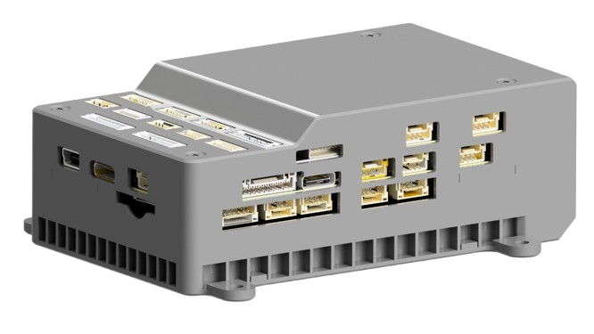

# Jetson Custom Board

**Integrated Flight Control & Edge Computing Platform**

The Jetson Custom Board is designed as an integrated flight control and computing platform for autonomous systems and advanced embedded applications. The hardware architecture consolidates real-time flight control and high-level computing into a single unified board.

This approach simplifies system integration, reduces cabling complexity, and improves overall system reliability.

