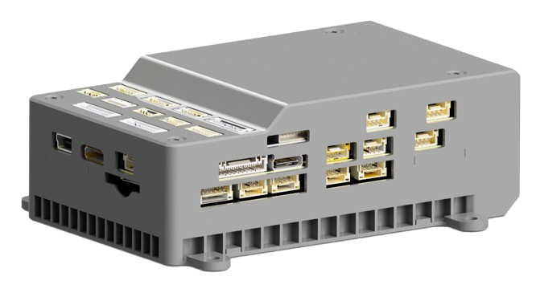

# Lectron Jetson Autopilot

## **Pixhawk V6X Compatible Autopilot with Nvidia Jetson Boards**

!!! note "Supported Jetson Modules"
    This product supports the following NVIDIA Jetson modules: **Jetson Nano**, **Jetson Xavier NX**, and **Jetson TX2 NX**.

The Lectron Jetson Autopilot is designed as an integrated flight control and computing platform for autonomous systems and advanced embedded applications. The hardware architecture consolidates real-time flight control and high-level computing into a single unified board.

This approach simplifies system integration, reduces cabling complexity, and improves overall system reliability.

## **Product Description**

Lectron Jetson Autopilot is a high-performance autopilot platform designed for systems that require advanced onboard computing alongside reliable real-time flight control. By pairing deterministic control with NVIDIA Jetson’s computing capabilities, it enables intelligent autonomous operation.

The platform is optimized for applications involving onboard perception, data processing, and decision-making, while maintaining a clear separation between safety-critical control and high-level computation. This makes Lectron Jetson Autopilot well-suited for complex autonomous platforms and data-driven aerial systems.