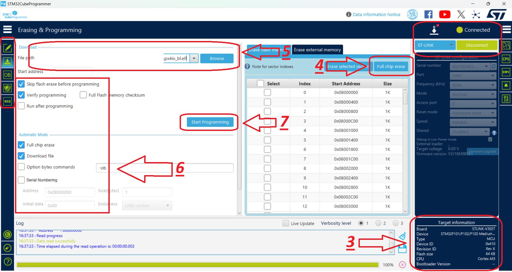

# Initial Installation

## **Jetson Xavier NX — Flashing the Custom BSP**

Flashing is done from a Linux host using a Docker container. The BSP targets **Jetson Xavier NX** on the Lectron carrier board (L4T R32.7.3 / JetPack 4.6.x, board config `lectron-jetson-xavier-nx`). Boot target is either the module’s internal **eMMC** or an external **SD card**.

!!! tip "Jetson Nano"
    The same procedure applies to Jetson Nano — replace `lectron-jetson-xavier-nx` with `lectron-jetson-nano` wherever it appears.

**Requirements:** Linux host with Docker and a mini-USB cable. SD-card option also needs a card reader.

---

### **1. Create the Container**

```bash
export L4T_WORK="$HOME/l4t/work"
mkdir -p "$L4T_WORK"
sudo docker run -it --privileged \
  --name l4t-flash \
  -v /dev:/dev \
  -v "$L4T_WORK:/work" \
  ubuntu:18.04 bash
```

!!! info "Re-entering"
    Use `sudo docker start -ai l4t-flash` to re-attach — don’t run `docker run` again.

Install dependencies inside the container:

```bash
apt-get update && apt-get install -y \
  binutils perl python3 python3-pip libxml2-utils device-tree-compiler \
  abootimg cpp sshpass udev dosfstools openssl uuid-runtime \
  qemu-user-static binfmt-support libgmp10 bc liblz4-tool zip unzip \
  cpio rsync xxd bzip2 lbzip2 whiptail wget nano sudo
ln -sf /usr/bin/python3 /usr/bin/python
pip3 install pycryptodome
```

---

### **2. Load the BSP**

```bash
cd /work
wget https://github.com/lectronuser/lectron-public/releases/download/v1.0.0/Lectron_Jetson_Xavier_NX_BSP_R32.7.3.tbz2
tar -xpf Lectron_Jetson_Xavier_NX_BSP_R32.7.3.tbz2 --numeric-owner
cd /work/Linux_for_Tegra
./apply_binaries.sh
```

Other supported BSPs are available on the [releases](https://github.com/lectronuser/lectron-public/releases) page.

---

### **3. Force Recovery Mode**

Required before any flash operation.

1. Press and hold both **FRCV** and **RST** buttons.
2. Apply power while holding them; keep held ~10 seconds.
3. Release **RST** first, then **FRCV**.
4. Connect a mini-USB cable from the host to the **JN USB0** port.

Confirm with `lsusb` — an **NVIDIA Corp.** entry means recovery mode is active.

---

### **4. Flash to eMMC**

```bash
cd /work/Linux_for_Tegra
sudo ./flash.sh lectron-jetson-xavier-nx mmcblk0p1
```

---

### **5. Flash to SD Card**

**5.1 Prepare the card** (host card reader required — destructive, confirm device node first):

```bash
lsblk   # identify your card, e.g. /dev/sdX
cd /work/Linux_for_Tegra
sudo ./prepare_sd_card.sh /dev/sdX
```

Remove the card from the reader when the script reports completion.

**5.2 Flash the bootloader:**

1. Insert the prepared SD card into the board’s SD slot.
2. Enter Force Recovery mode (Section 3).

```bash
cd /work/Linux_for_Tegra
sudo ./flash.sh lectron-jetson-xavier-nx external
```

---

### **6. First Boot**

The module reboots automatically after flashing. Initial boot takes longer than usual. Use a FTDI module on the **JN UART2** port for first-boot setup. Verify board customizations:

```bash
systemctl status ksz8795-init.service
ls /dev/spidev*
```


## **FMU Firmware Installation**

This section contains step-by-step instructions for flashing the bootloader and firmware onto the **FMU IO (F103)** and **FMU MAIN (H753)** chips using **STM32CubeProgrammer**.

!!! danger "Wiring — Before You Start"
	Before the flashing process, make sure the debug cable and the ST-Link / CubeProgrammer pins are connected correctly:

	```text
	SWDIO   >>> SWDIO
	SWDCLK  >>> SWDCLK
	GND     >>> GND
	NRST    >>> NRST
	```

	The Autopilot board must be powered (via **USB** or **XT30**) before performing these steps.

!!! note "ArduPilot vs. PX4"
	The FMU bootloader and FMU firmware files differ depending on the autopilot software (**ArduPilot** or **PX4**). The flashing procedure remains the same — only the target files change.

### **Connection Settings**
Select the connection settings on the right-hand panel as shown below, then use the **Connect** button. After connecting, the target chip is shown in the **bottom-right corner** (`STM32F10x` for the IO chip, `STM32H7` for the FMU chip).


### **1. IO Chip Flashing (F103)**

**Hardware Connections**

1. Connect the debug cable (10-pin GHS-10) to the IO debug port.
2. Connect the ST-Link to the computer.

**STM32CubeProgrammer Steps**

1. Launch **STM32CubeProgrammer**. Select the connection settings on the right panel and click **Connect**.
2. Switch to the programming panel using the left-hand toolbar.
3. After the ST-Link connects, verify that **STM32F10x** is displayed in the bottom-right corner.
4. Click **Full chip erase** to wipe any existing code. In the confirmation pop-up (*"Are you sure you want to erase full chip flash memory"*), click **OK**.
5. Select the provided **IO bootloader** file.
6. Check the programming configuration options as indicated in the reference layout.
7. Click **Start Programming**.



8. Once complete, dismiss the *"Download verified successfully"* and *"File download complete"* alerts by clicking **OK**.
9. The **IO installation is complete**.
10. For safety, disconnect from the hardware by clicking **Disconnect** (which replaces the *Connect* button).

### **2. FMU Chip Flashing (H753)**

This stage installs the **Bootloader** first, followed by the **FMU Firmware**.

**Hardware Connections**

1. Connect the debug cable (10-pin GHS-10) to the FMU debug port.
2. Connect the ST-Link to the computer.

#### **FMU Bootloader Flashing**

1. Launch **STM32CubeProgrammer** and click **Connect** (top-right).
2. Switch to the programming panel using the left-hand toolbar.
3. After the ST-Link connects, verify that **STM32H7** is displayed in the bottom-right corner.
4. Click **Full chip erase** to wipe any existing code, then click **OK** on the confirmation pop-up.
5. Select the provided **FMU Bootloader** file.
6. Check the installation options as indicated in the reference layout.
7. Click **Start Programming**.


8. Once complete, close the *"Download verified successfully"* and *"File download complete"* prompts by clicking **OK**.
9. The **FMU Bootloader installation is complete**.
10. For safety, click **Disconnect** (top-right).

#### **FMU Firmware Flashing**

1. Launch **STM32CubeProgrammer** and click **Connect** (top-right).
2. Switch to the programming panel using the left-hand toolbar.
3. Ensure that **STM32H7** is displayed in the bottom-right corner as the target chip.
4. Select the provided **FMU Firmware** file.
5. Check the programming options as shown in the reference image.

	!!! danger "CRITICAL"
		Uncheck the **Full chip erase** box to prevent wiping the bootloader you just installed.

6. Click **Start Programming** to begin flashing the firmware.


7. When the operation completes, confirm and close the *"Download verified successfully"* and *"File download complete"* alerts by clicking **OK**.
8. The **FMU Firmware installation is complete**.