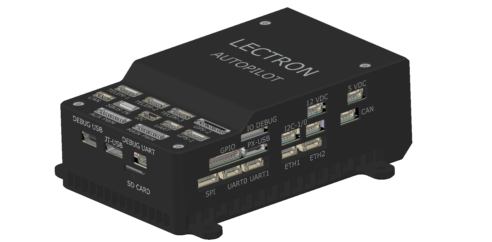
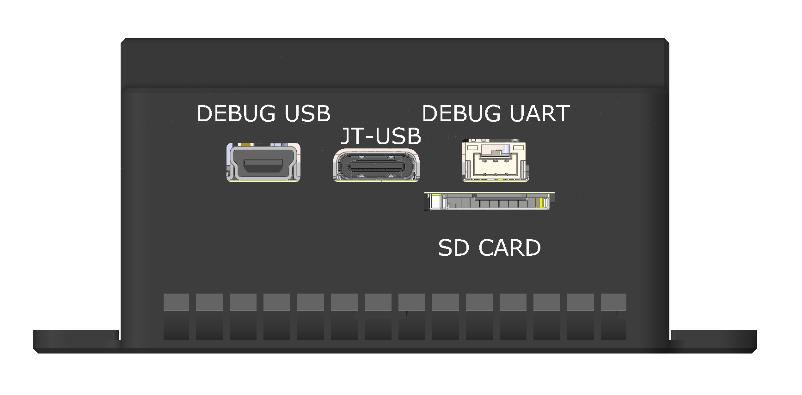
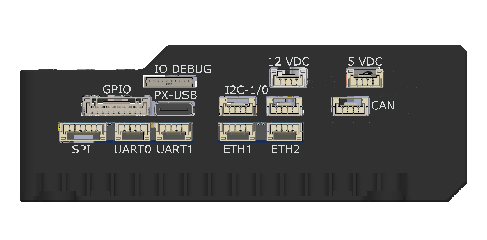
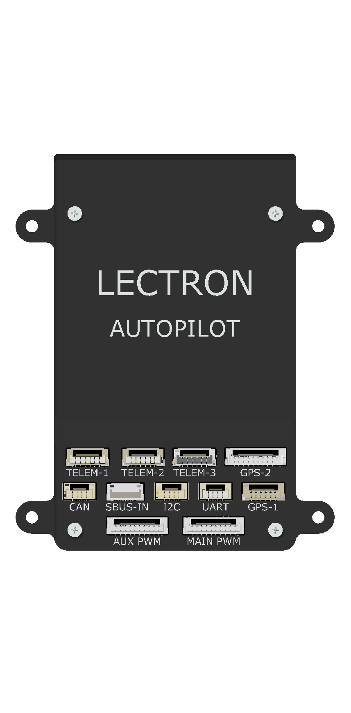
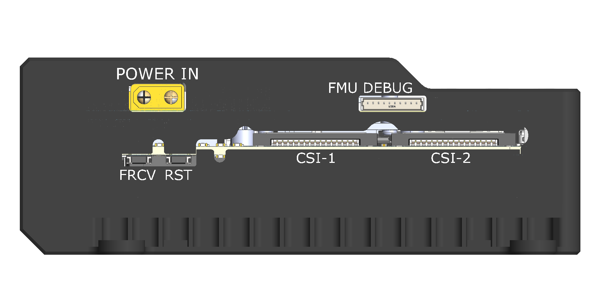
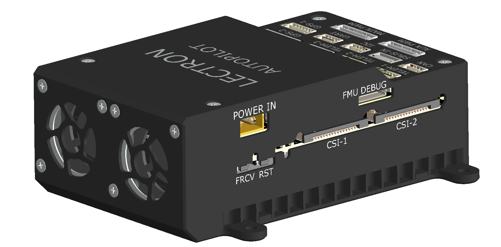
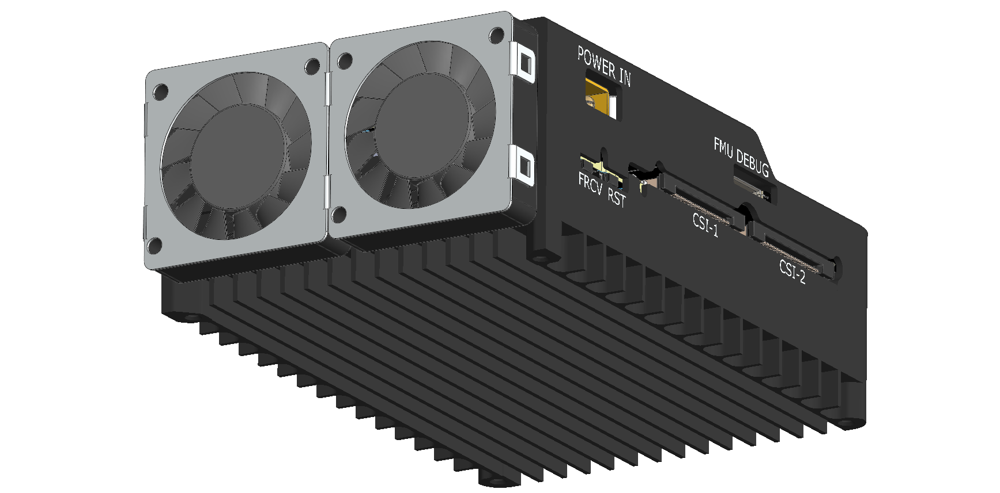

# Specification

| | |
| :---: | :---: |
|  |  |

## Jetson & System Support

| Feature | Description |
|-------|---------------|
| Supported Jetson Modules | Jetson Nano, Xavier NX, AGX Xavier, Orin |
| SoM Connector            | 260-Pin DDR4 SODIMM |
| Power Regulation         | Dedicated 5.1 V – 5 A rail |
| Cooling                  | Active & passive advanced rail cooling |
| Camera Interface         | 2 × 15-Pin, 1 mm pitch CSI |
| USB                      | USB 3.0 Type-C (2 A), USB 2.0 Mini-B |
| Debug                    | Debug UART, Force Recovery & Reset |
| Ethernet                 | 2 × 4-Pin, 100 Mbps |
| GPIO                     | 1 × 10-Pin |
| I2C                      | 2 × 4-Pin (isolated buses) |
| UART                     | 1 × 4-Pin (isolated buses) |
| CAN                      | 1 × 4-Pin |
| SPI                      | 1 × 6-Pin |

---

| | |
| :---: | :---: |
|  |  |

## Pixhawk & System Support

| Feature | Description |
|-------|---------------|
| Supported Autopilots | Pixhawk 5X, Pixhawk 6X |
| Power Regulation     | Dedicated 5.1 V – 3 A rail |
| Power Distribution   | Onboard regulated |
| Ethernet             | Embedded 100 Mbps |
| Port Compatibility   | Pixhawk & Jetson standards |
| Cooling              | Designed for heavy workloads |
| Main Connectors      | 100-Pin & 50-Pin Hirose DF40 |
| TELEM                | 2 × 6-Pin |
| GPS                  | Full (10-Pin), Basic (6-Pin) |
| CAN                  | 1 × 4-Pin |
| I2C                  | 1 × 4-Pin |
| UART                 | 1 × 4-Pin |
| RC / SBUS            | 1 × 5-Pin |
| PWM                  | AUX & MAIN, 10-Pin |
| Ethernet             | 1 × 4-Pin |
| Debug                | FMU-IO Debug, 11-Pin (SH) |
| Jetson Link          | UART or Ethernet |

---

| | |
| :---: | :---: |
|  |  |

## Power Architecture

| Feature | Description |
|-------|---------------|
| Power-In           | XT30 with reverse protection, soft-start |
| Input Voltage      | 10 – 35 VDC (XT30) |
| Bulk Capacitor     | 220 µF |
| 5.0 V Rail         | 5.0 V – 3 A (Pixhawk & outputs) |
| 5.1 V Rail         | 5.1 V – 5 A (Jetson & peripherals) |
| 12 V Rail          | 12 V – 2 A (sensors/actuators) |
| Protection         | Over-current & short-circuit sensing |
| Battery Monitoring | Input voltage sensing |

---

| | |
| :---: | :---: |
|  |  |

## Thermal Management

| Feature | Description |
|-------|---------------|
| Fans           | 2 × 12 VDC, 12 W Intake Blower |
| Fan Control    | Jetson fan framework or On/Off |
| Airflow        | Forced convection over heat-sink |
