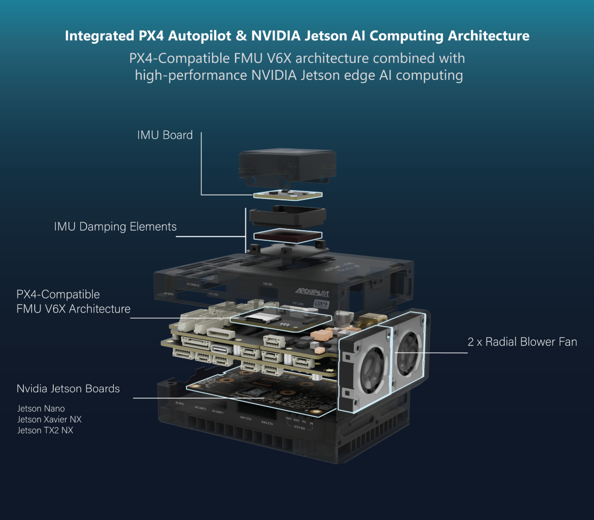
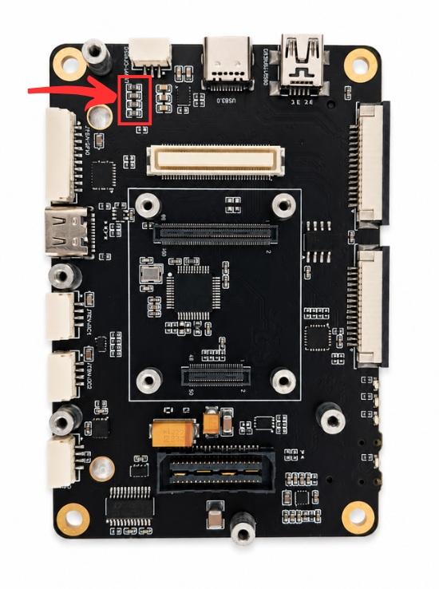

# Specification

## **Jetson & System Support**

| Feature | Description |
|-------|---------------|
| Supported Jetson Modules | Jetson Nano, Xavier NX, AGX Xavier, Orin |
| SoM Connector            | 260-Pin DDR4 SODIMM |
| Power Regulation         | Dedicated 5.1 V – 5 A rail |
| Cooling                  | Active & passive advanced rail cooling |
| Camera Interface         | 2 × 15-Pin, 1 mm pitch CSI |
| USB                      | USB 3.0 Type-C (2 A), USB 2.0 Mini-B |
| Debug                    | Debug UART, Force Recovery & Reset |
| Ethernet                 | 2 × 4-Pin, 100 Mbps |
| CSI Camera               | 2x 15-pin FFC |
| GPIO                     | 6-Pin |
| I2C                      | I2C0 |
|                          | I2C1 |
| UART                     | UART0 [^a] |
|                          | UART1 |
| DEBUG UART               | UART2 |
| SPI                      | External -> CS0 |
|                          | CAN -> CS1 |
|                          | BMI270 -> GPIO10 |
|                          | ETH Switch (KSZ8795) -> GPIO11 |

## **Pixhawk & System Support**

| Feature | Description |
|-------|---------------|
| Supported Firmware     | ArduPilot, PX4 |
| FMU Processor          | STM32H753IIK6TR (32-bit Arm® Cortex®-M7, 480MHz, 2MB flash memory, 1MB RAM)|
| IO Processor           | STM32F103 (32 Bit Arm® Cortex®-M3, 72MHz, 64KB SRAM) |
| Power Regulation       | Dedicated 5.1 V – 3 A rail |
| Power Distribution     | Onboard regulated |
| Ethernet               | Embedded 100 Mbps |
| Port Compatibility     | Pixhawk & Jetson standards |
| Main Connectors        | 100-Pin & 50-Pin Hirose DF40 |
| TELEM                  | TELEM1  (UART7) |
|                        | TELEM2  (UART5) |
|                        | TELEM3  (USART2) [^a] |
| GPS                    | Full 10-pin JST-GH (UART1, I2C1, 5V Out) |
|                        | Basic 6-pin JST-GH (UART8, I2C2, 5V Out) |
| CAN                    | 1 |
| I2C                    | I2C3 |
| UART                   | UART4 |
| FMU USB                | USB Type-C |
| RC / SBUS              | PPM, S.BUS (5-Pin JST-GH) |
| PWM Outputs            | 8 Channels FMU + 8 Channels IO (10-Pin JST-GH) |
| Ethernet               | 1 × 4-Pin |
| FMU/IO Debug Interface | SWD (10-Pin JST-SH) |
| Jetson Link            | UART or Ethernet |
| FMU Onboard Sensors    | IMU: ICM-42670-P (SPI) | Barometer: BMP390 (I2C) | FRAM: FM25V02A | EEPROM: AT24C02D |
| Sensor Board           | IMU1: BMI270 (SPI), IMU2: ICM-42670-P (SPI), Barometer:BMP390 (I2C), Magnetometer: BMM350 (I2C), EEPROM: 24LC64T |

## **Power Architecture**

| Feature | Description |
|-------|---------------|
| Power-In           | XT30 with reverse protection |
| Input Voltage      | 12V – 25V (3S-6S LiPo) |
| Power Monitor      | Internal Voltage & external I2C Current Monitor |
| 5.0 V Rail         | 5.0 V – 3 A (Pixhawk & outputs) |
| 5.1 V Rail         | 5.1 V – 5 A (Jetson & peripherals) |
| 12 V Rail          | 12 V – 2 A (sensors/actuators) |
| Protection         | Over-current & short-circuit sensing |
| Battery Monitoring | Input voltage sensing |

## **Ethernet Switch**

| Feature | Description |
|-------|---------------|
| IC                  | KSZ8795 5-Port 10/100 Managed Switch |
| Port Speed          | 100 Mbps per port |
| External Ports      | 2 × 4-Pin (Ethernet 1 & Ethernet 2) |
| Internal Ports      | 1 × Jetson MAC, 1 × FMU MAC |
| Configuration       | SPI (Jetson SPI0-CS1) |
| Status LEDs         | 4 × Blue — link / activity per port |

## **Thermal Management**

| Feature | Description |
|-------|---------------|
| Fans           | 2 × 5 VDC, 0.75 W Intake Blower |
| Fan Control    | Jetson fan framework |
| Airflow        | Forced convection over heat-sink |

[^a]: TELEM3 (FMU USART2) and Jetson UART0 are bridged by default, enabling direct serial communication between the FMU and Jetson. To operate each port independently, remove the bridge resistors indicated in the image below.

    { width="300", style="transform: rotate(90deg); display: block; margin: 0 auto;" }
