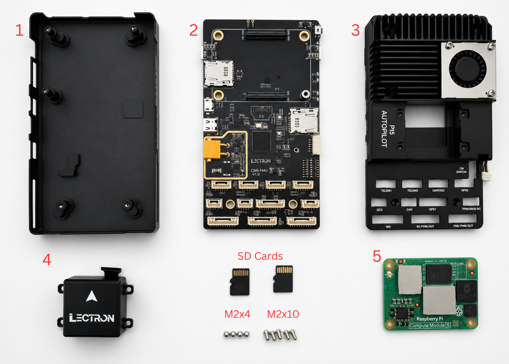
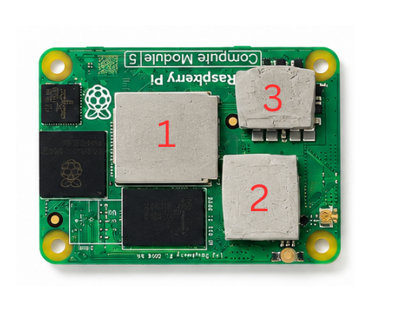
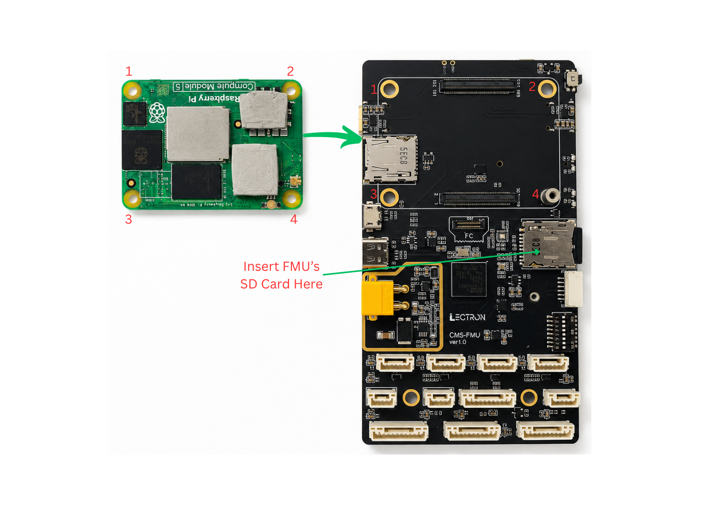
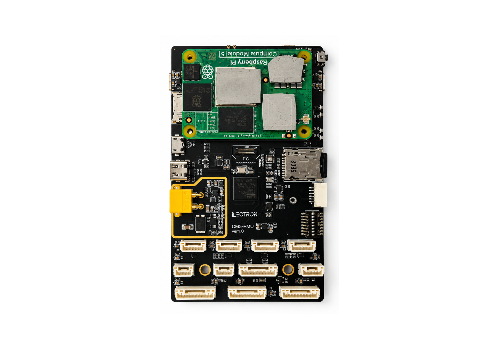
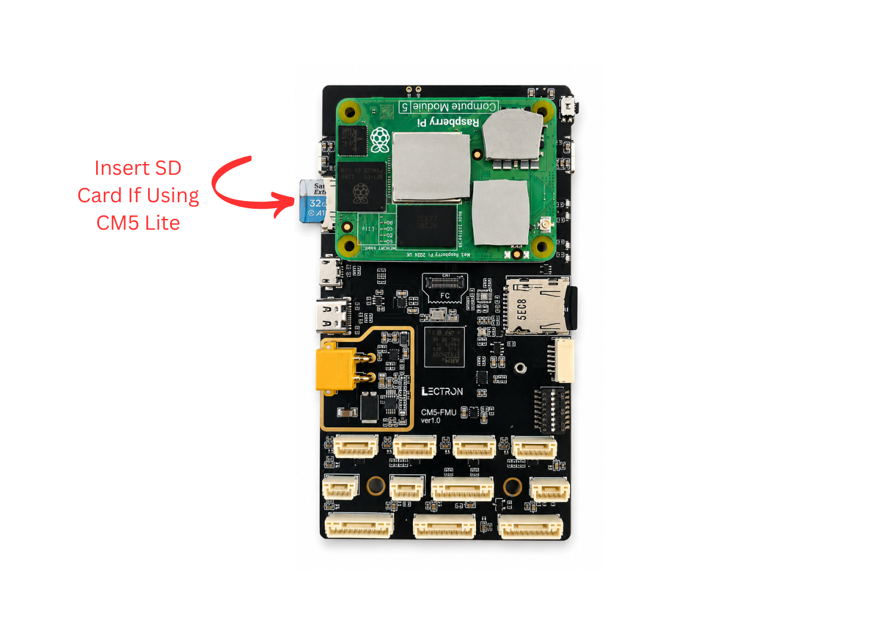
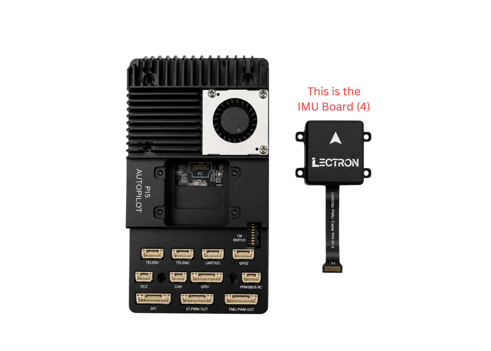
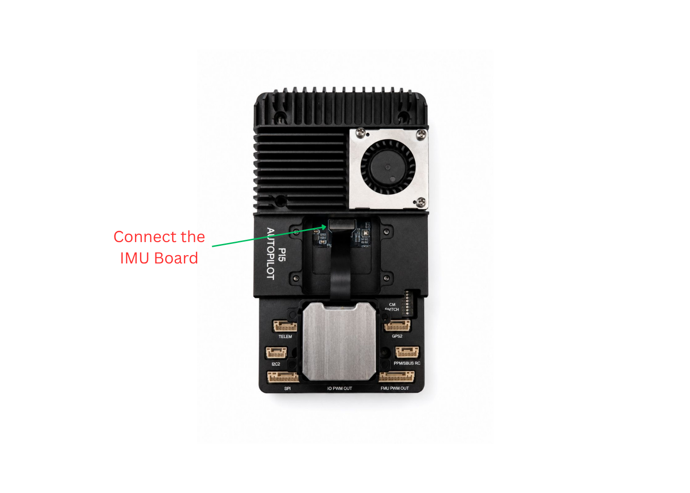
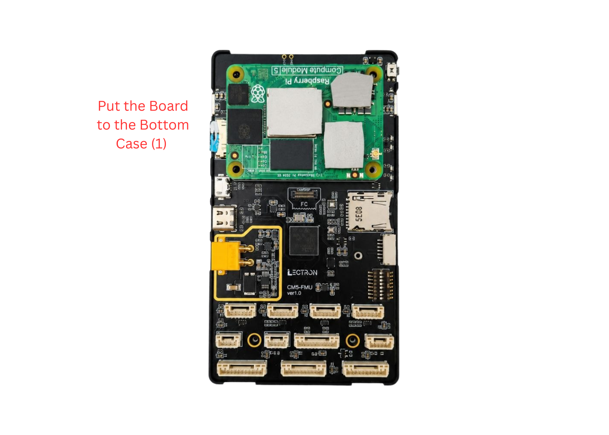
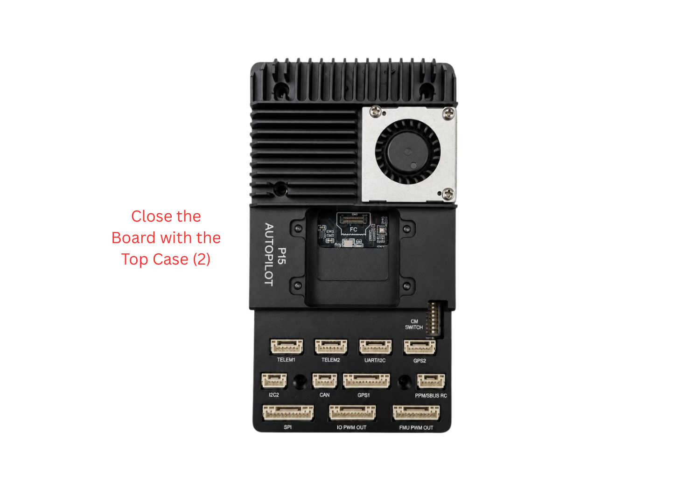
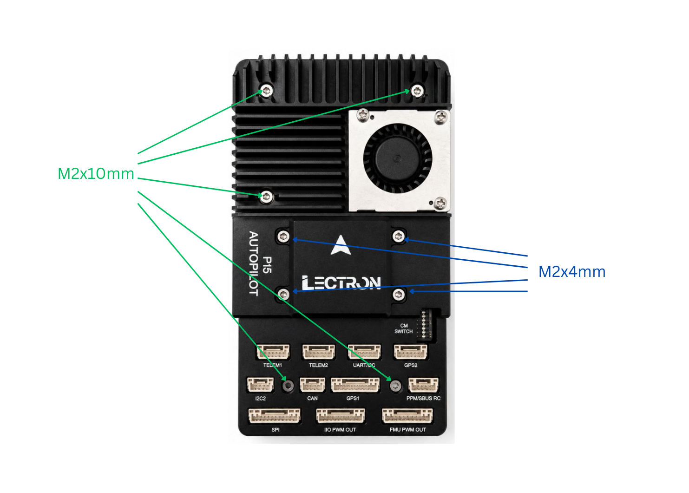

# Assembly Guide

This guide walks through assembling the **Lectron PI5 Autopilot** — mounting the Raspberry Pi Compute Module 5, connecting the IMU board, and closing the enclosure.

## **What's in the Box**

Before starting, make sure you have all of the following components:

| # | Component |
| :-: | :-------- |
| 1 | Bottom case |
| 2 | CM5-FMU baseboard |
| 3 | Top case (PI5 Autopilot heatsink + fan) |
| 4 | IMU board |
| 5 | Raspberry Pi Compute Module 5 (CM5) |
| — | MicroSD card(s) |
| — | Screws: **4 pcs M2×4 mm** (IMU board) and **5 pcs M2×10 mm** (case) |

---

## **Step 1 — Apply the Thermal Pads**

Before mounting the Compute Module 5, apply the supplied thermal pads to the CM5's chips. The pads transfer heat from the module to the top-case heatsink and are **required** for proper cooling.

Place a thermal pad on each of the three areas marked **1**, **2**, and **3** on the CM5 as shown below.

!!! warning "Don't Skip the Thermal Pads"
    Operating the CM5 without the thermal pads in place can cause the module to overheat and throttle or shut down. Make sure all three pads are fitted before mounting the module.

---

## **Step 2 — Mount the Compute Module 5**

Align the CM5 with the board's connectors using the corner markings (**1–4**) and press it firmly onto the baseboard.

If you are running the autopilot firmware from the FMU's microSD, insert it into the slot indicated (**Insert FMU's SD Card Here**).

Once seated correctly, the assembly should look like this:

!!! note "CM5 Lite"
    If you are using a **CM5 Lite** (no onboard eMMC), insert a microSD card into the CM5's card slot as shown below.

    

---

## **Step 3 — Connect the IMU Board**

The **IMU board (4)** connects to the FMU via the FPC ribbon cable.

Route the ribbon cable and connect the IMU board to the FMU connector as shown.

!!! danger "Handle the FPC Cable with Care"
    Be **gentle** when seating the cable into the connector — insert it straight and apply only light, even pressure. Do **not** bend the cable sharply, pull on it, or force it in, as this may damage the ribbon cable or the connector.

---

## **Step 4 — Place the Board in the Bottom Case**

Lower the assembled baseboard into the **bottom case (1)**, aligning the mounting holes.

---

## **Step 5 — Close with the Top Case**

Fit the **top case (2)** — the P15 Autopilot heatsink and fan assembly — over the board, aligning the connector cutouts with the baseboard ports.

---

## **Step 6 — Fasten the Screws**

Secure the assembly with the supplied screws:

- **M2×10 mm** — fasten the case (heatsink to baseboard / bottom case).
- **M2×4 mm** — secure the IMU board.

!!! tip "Done"
    The Lectron PI5 Autopilot is now assembled. Continue with the [Initial Installation](setup.md) guide to flash the Compute Module and the FMU firmware.
