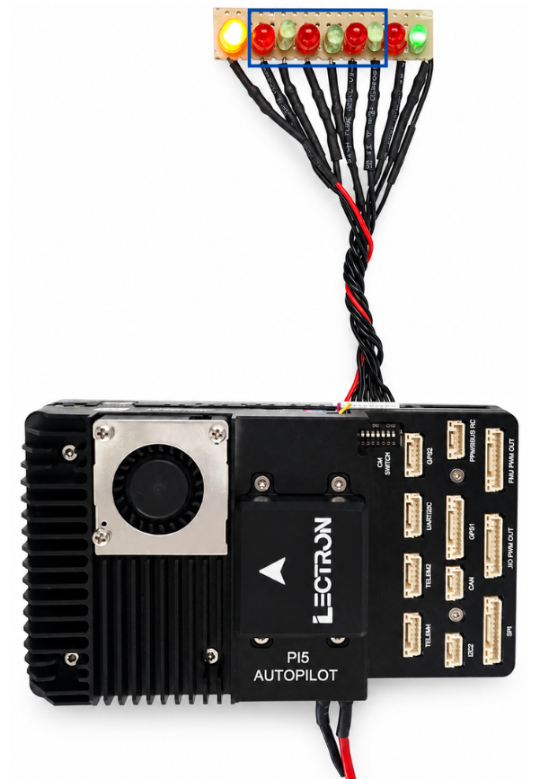
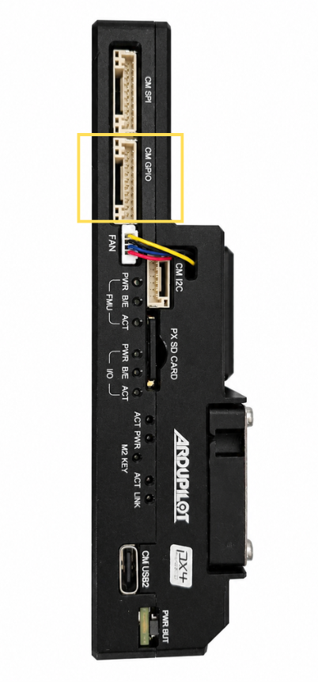
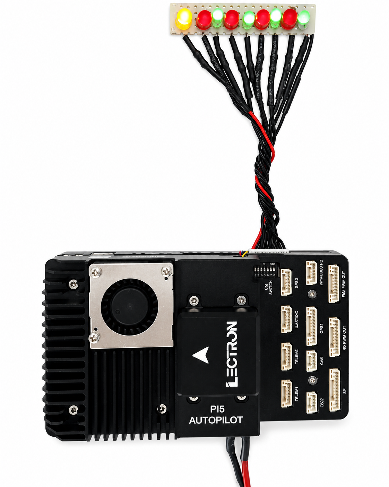

# CM5 GPIO

**General Purpose I/O — Hardware & Software Guide**

| | |
| :-- | :-- |
| **Platform** | Raspberry Pi CM5 |
| **OS** | Ubuntu 24.04 LTS |
| **Connector** | SM10B-GHS (10-pin) |

---

## **Hardware Overview**

The CM GPIO port is a 10-pin JST GH connector (**SM10B-GHS**) on the Lectron PI5 Autopilot board. It exposes six general-purpose I/O lines from the Raspberry Pi CM5, a 5 V power supply pin, and a ground reference. Pins 8 and 9 carry UART2 TX/RX and are not covered in this document.

### **Board Photos**
The image below shows the CM GPIO connector with an LED test harness connected.

{ width="360" }

The connector is located on the board side panel:

{ width="320" }

---

## **Pin Assignment**

The table below lists all 10 pins of the CM GPIO connector. The six GPIO pins are the focus of this document.

| Pin | Signal | Voltage | Direction | Notes |
| :-: | :----- | :-----: | :-------- | :---- |
| 1 | SYSTEM 5V | +5V | Power | Board supply voltage |
| 2 | CM5 GPIO22 | +3.3V | I/O | General purpose I/O |
| 3 | CM5 GPIO23 | +3.3V | I/O | General purpose I/O |
| 4 | CM5 GPIO24 | +3.3V | I/O | General purpose I/O |
| 5 | CM5 GPIO25 | +3.3V | I/O | General purpose I/O |
| 6 | CM5 GPIO26 | +3.3V | I/O | General purpose I/O |
| 7 | CM5 GPIO27 | +3.3V | I/O | General purpose I/O |
| 8 | CM5 UART2 TX | +3.3V | Output | UART2 transmit (not covered here) |
| 9 | CM5 UART2 RX | +3.3V | Input | UART2 receive (not covered here) |
| 10 | GROUND | GND | Power | Common ground reference |

!!! note "UART2 Pins"
    Pins 8 and 9 (UART2 TX/RX) share the same connector but are documented separately in the UART interface guide.

---

## **Linux GPIO Interface**

### **GPIO Chip**
On Ubuntu 24.04 with the CM5, the main RP1 GPIO controller is exposed as **`gpiochip4`**. This is the chip that controls GPIO22–GPIO27.

```console
$ sudo gpiodetect
gpiochip0 [gpio-brcmstb@107d508500] (32 lines)
gpiochip1 [gpio-brcmstb@107d508520] (4 lines)
gpiochip2 [gpio-brcmstb@107d517c00] (15 lines)
gpiochip3 [gpio-brcmstb@107d517c20] (6 lines)
gpiochip4 [pinctrl-rp1] (54 lines)    <-- this one
```

### **Verify GPIO Lines**
Confirm GPIO22–27 are available and unused:

```console
$ sudo gpioinfo gpiochip4 | grep -E 'GPIO2[2-7]'
line  22: "GPIO22"  unused  input  active-high
line  23: "GPIO23"  unused  input  active-high
line  24: "GPIO24"  unused  input  active-high
line  25: "GPIO25"  unused  input  active-high
line  26: "GPIO26"  unused  input  active-high
line  27: "GPIO27"  unused  input  active-high
```

---

## **Command-Line Usage (gpiod)**

The `gpiod` package is pre-installed on Ubuntu 24.04. All commands require `sudo`.

### **Set a Single Pin HIGH**

```bash
# Drive GPIO22 HIGH for 3 seconds
sudo gpioset --mode=time -s 3 gpiochip4 22=1
```

### **Set All GPIO Pins HIGH**

```bash
# Drive all six GPIO pins HIGH for 5 seconds
sudo gpioset --mode=time -s 5 gpiochip4 22=1 23=1 24=1 25=1 26=1 27=1
```

### **Read a Pin State**

```bash
# Read the current state of GPIO22
sudo gpioget gpiochip4 22
```

---

## **C Programming Example**

The following C program uses the Linux kernel's `gpio.h` interface directly via `ioctl` — no additional libraries are required beyond standard Linux headers.

### **Build**

```bash
gcc -o gpio_led_test gpio_led_test.c
sudo ./gpio_led_test
```

### **Source Code**

```c title="gpio_led_test.c"
#include <stdio.h>
#include <stdlib.h>
#include <unistd.h>
#include <fcntl.h>
#include <string.h>
#include <errno.h>
#include <linux/gpio.h>
#include <sys/ioctl.h>

#define GPIO_CHIP "/dev/gpiochip4"
#define NUM_LEDS  6

int main() {
    int chip_fd;
    struct gpiohandle_request req;
    struct gpiohandle_data data;
    int gpio_lines[NUM_LEDS] = {22, 23, 24, 25, 26, 27};

    chip_fd = open(GPIO_CHIP, O_RDONLY);
    if (chip_fd < 0) {
        fprintf(stderr, "Failed to open %s: %s\n",
                GPIO_CHIP, strerror(errno));
        return 1;
    }

    memset(&req, 0, sizeof(req));
    for (int i = 0; i < NUM_LEDS; i++)
        req.lineoffsets[i] = gpio_lines[i];
    req.lines = NUM_LEDS;
    req.flags = GPIOHANDLE_REQUEST_OUTPUT;
    strcpy(req.consumer_label, "led_test");

    if (ioctl(chip_fd, GPIO_GET_LINEHANDLE_IOCTL, &req) < 0) {
        fprintf(stderr, "Failed to get line handle: %s\n",
                strerror(errno));
        close(chip_fd);
        return 1;
    }

    /* All ON */
    memset(&data, 1, sizeof(data));
    ioctl(req.fd, GPIOHANDLE_SET_LINE_VALUES_IOCTL, &data);
    sleep(2);

    /* One by one ON */
    memset(&data, 0, sizeof(data));
    for (int i = 0; i < NUM_LEDS; i++) {
        data.values[i] = 1;
        ioctl(req.fd, GPIOHANDLE_SET_LINE_VALUES_IOCTL, &data);
        usleep(400000);
    }

    /* Blink 5 times */
    for (int b = 0; b < 5; b++) {
        memset(&data, 1, sizeof(data));
        ioctl(req.fd, GPIOHANDLE_SET_LINE_VALUES_IOCTL, &data);
        usleep(300000);
        memset(&data, 0, sizeof(data));
        ioctl(req.fd, GPIOHANDLE_SET_LINE_VALUES_IOCTL, &data);
        usleep(300000);
    }

    close(req.fd);
    close(chip_fd);
    return 0;
}
```

---

## **Result**

With the LED test harness connected, running the program drives the GPIO lines and lights the LEDs as shown below.

{ width="360" }
