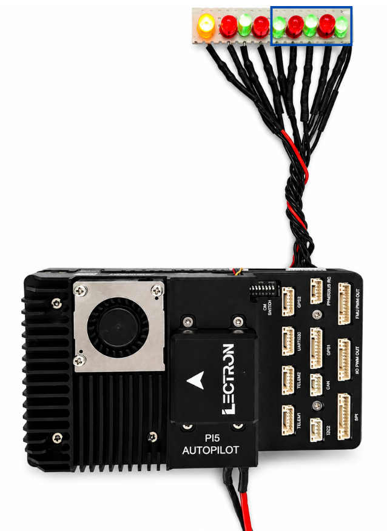
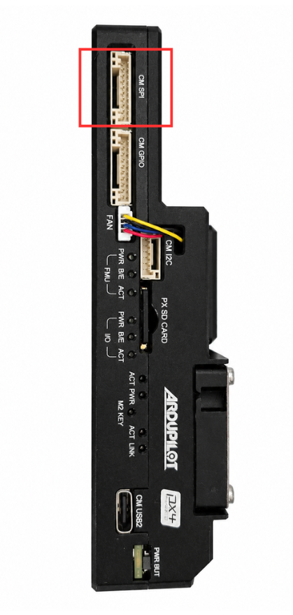

# CM5 PWM

**PWM Channels — Hardware & Software Guide**

| | |
| :-- | :-- |
| **Platform** | Raspberry Pi CM5 |
| **OS** | Ubuntu 24.04 LTS |
| **Connector** | SM10B-GHS (10-pin) |

---

## **Hardware Overview**

The CM SPI/PWM port is a 10-pin JST GH connector (**SM10B-GHS**) on the Lectron PI5 Autopilot board. Pins 6–9 expose four software PWM channels from the Raspberry Pi CM5, driven via **GPIO12–GPIO15**. Pin 1 provides 5 V power and pin 10 is ground. Pins 2–5 carry the SPI1 bus, which is documented separately.

### **Board Photos**
The images below show the LED test setup connected to the PWM pins, and the connector location on the board side panel.

{ width="360" }

{ width="320" }

---

## **Pin Assignment**

The four PWM pins are the focus of this document. SPI pins share the same connector but are documented separately.

| Pin | Signal | Voltage | GPIO | Notes |
| :-: | :----- | :-----: | :--- | :---- |
| 1 | SYSTEM 5V | +5V | — | Board supply voltage |
| 2 | CM5 SPI1 SCLK | +3.3V | — | SPI1 clock (not covered here) |
| 3 | CM5 SPI1 SIO1 | +3.3V | — | SPI1 MISO (not covered here) |
| 4 | CM5 SPI1 SIO0 | +3.3V | — | SPI1 MOSI (not covered here) |
| 5 | CM5 SPI1 CS1 | +3.3V | — | SPI1 chip select (not covered here) |
| 6 | CM5 PWM CH1 | +3.3V | GPIO12 | PWM channel 1 |
| 7 | CM5 PWM CH2 | +3.3V | GPIO13 | PWM channel 2 |
| 8 | CM5 PWM CH3 | +3.3V | GPIO14 | PWM channel 3 |
| 9 | CM5 PWM CH4 | +3.3V | GPIO15 | PWM channel 4 |
| 10 | GROUND | GND | — | Common ground reference |

---

## **PWM on Ubuntu 24.04 / CM5**

### **Hardware PWM Limitation**
Software PWM via the Linux GPIO `ioctl` interface (`gpiochip4`) is the recommended approach and works reliably on all four PWM pins.

### **Verify GPIO Lines**
Confirm GPIO12–15 are available on `gpiochip4`:

```console
$ sudo gpioinfo gpiochip4 | grep -E 'GPIO1[2-5]'
line  12: "GPIO12"  unused  input  active-high
line  13: "GPIO13"  unused  input  active-high
line  14: "GPIO14"  unused  input  active-high
line  15: "GPIO15"  unused  input  active-high
```

---

## **Quick Test (Command Line)**

Before running code, verify the pins work with a simple high/low test:

```bash
# Drive all 4 PWM pins HIGH for 3 seconds
sudo gpioset --mode=time -s 3 gpiochip4 12=1 13=1 14=1 15=1

# Turn all off
sudo gpioset --mode=time -s 1 gpiochip4 12=0 13=0 14=0 15=0
```

---

## **Software PWM — C Example**

The program below implements software PWM using the Linux GPIO `ioctl` interface. It accepts a GPIO pin number as a command-line argument and cycles through 10%, 50%, and 90% brightness for 3 seconds each.

### **Build & Run**

```bash
gcc -o pwm_test pwm_test.c

# Run on GPIO12 (PWM CH1)
sudo ./pwm_test 12

# Run on GPIO13 (PWM CH2)
sudo ./pwm_test 13
```

### **Expected Output**

```text
=== CM PWM LED Test (GPIO12) ===

[1] 10% brightness...
[2] 50% brightness...
[3] 90% brightness...

Done.
```

### **Source Code**

```c title="pwm_test.c"
#include <stdio.h>
#include <stdlib.h>
#include <unistd.h>
#include <fcntl.h>
#include <string.h>
#include <errno.h>
#include <linux/gpio.h>
#include <sys/ioctl.h>

#define GPIO_CHIP     "/dev/gpiochip4"
#define PWM_PERIOD_US 1000   // 1 kHz

void set_duty(int fd, struct gpiohandle_data *data,
              int duty_percent, int duration_ms) {
    int on_time  = PWM_PERIOD_US * duty_percent / 100;
    int off_time = PWM_PERIOD_US - on_time;
    int cycles   = (duration_ms * 1000) / PWM_PERIOD_US;
    for (int i = 0; i < cycles; i++) {
        data->values[0] = 1;
        ioctl(fd, GPIOHANDLE_SET_LINE_VALUES_IOCTL, data);
        usleep(on_time);
        data->values[0] = 0;
        ioctl(fd, GPIOHANDLE_SET_LINE_VALUES_IOCTL, data);
        usleep(off_time);
    }
}

int main(int argc, char *argv[]) {
    if (argc != 2) {
        fprintf(stderr, "Usage: %s <gpio_pin>\n", argv[0]);
        fprintf(stderr, "Example: sudo ./pwm_test 12\n");
        return 1;
    }
    int gpio_pin = atoi(argv[1]);
    if (gpio_pin < 0 || gpio_pin > 53) {
        fprintf(stderr, "Error: invalid GPIO pin %d\n", gpio_pin);
        return 1;
    }
    int chip_fd;
    struct gpiohandle_request req;
    struct gpiohandle_data data;

    chip_fd = open(GPIO_CHIP, O_RDONLY);
    if (chip_fd < 0) { perror("open chip"); return 1; }

    memset(&req, 0, sizeof(req));
    req.lineoffsets[0] = gpio_pin;
    req.lines = 1;
    req.flags = GPIOHANDLE_REQUEST_OUTPUT;
    strcpy(req.consumer_label, "pwm_test");

    if (ioctl(chip_fd, GPIO_GET_LINEHANDLE_IOCTL, &req) < 0) {
        perror("get handle"); close(chip_fd); return 1;
    }

    memset(&data, 0, sizeof(data));

    printf("=== CM PWM LED Test (GPIO%d) ===\n\n", gpio_pin);

    printf("[1] 10%% brightness...\n");
    set_duty(req.fd, &data, 10, 3000);

    printf("[2] 50%% brightness...\n");
    set_duty(req.fd, &data, 50, 3000);

    printf("[3] 90%% brightness...\n");
    set_duty(req.fd, &data, 90, 3000);

    printf("\nDone.\n");
    data.values[0] = 0;
    ioctl(req.fd, GPIOHANDLE_SET_LINE_VALUES_IOCTL, &data);
    close(req.fd);
    close(chip_fd);
    return 0;
}
```

---

## **How Software PWM Works**

Software PWM rapidly toggles a GPIO pin HIGH and LOW to simulate an analog output level. The ratio of ON time to the total period is called the **duty cycle**.

| Duty Cycle | ON Time | OFF Time | Effect |
| :--------: | :-----: | :------: | :----- |
| 0% | 0 µs | 1000 µs | LED OFF |
| 10% | 100 µs | 900 µs | Very dim |
| 50% | 500 µs | 500 µs | Half brightness |
| 90% | 900 µs | 100 µs | Near full brightness |
| 100% | 1000 µs | 0 µs | LED fully ON |

!!! note "Timing"
    Period = 1000 µs (1 kHz). All timing values are based on the `PWM_PERIOD_US` constant in the source code.
