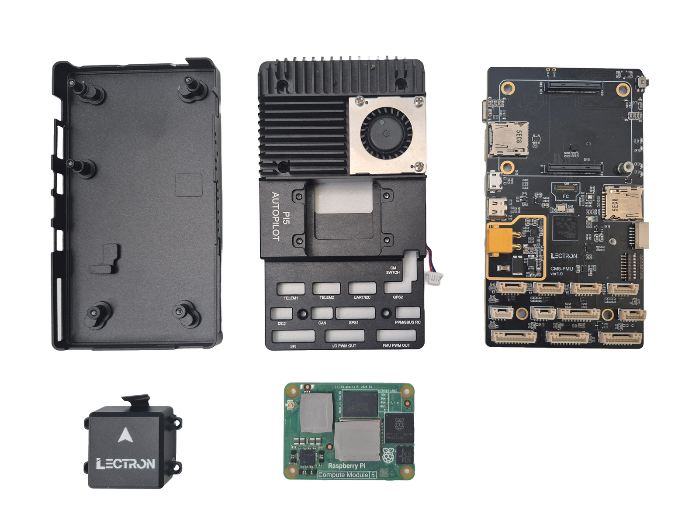

# Lectron Pi5 Autopilot

## **Pixhawk V6X Compatible Autopilot with Compute Module 5**

The Raspberry CM5 Board is designed as an integrated flight control and computing platform for autonomous systems and advanced embedded applications. The hardware architecture consolidates real-time flight control and high-level computing into a single unified board.

This approach simplifies system integration, reduces cabling complexity, and improves overall system reliability.

## **Product Description**

Lectron PI5 Autopilot is a compact autopilot platform that combines real-time flight control with the flexibility of Raspberry Pi 5 computing. It is designed to support advanced autonomy applications while maintaining stable and deterministic control behavior.

The platform enables developers and system integrators to run high-level applications alongside flight control logic, making it suitable for prototyping, testing, and deployment of autonomous aerial systems. Its architecture bridges low-level control and high-level computing within a single integrated solution.

