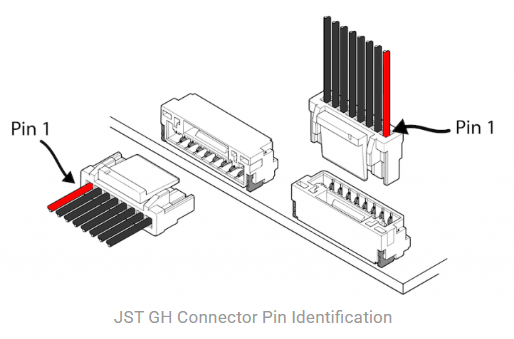
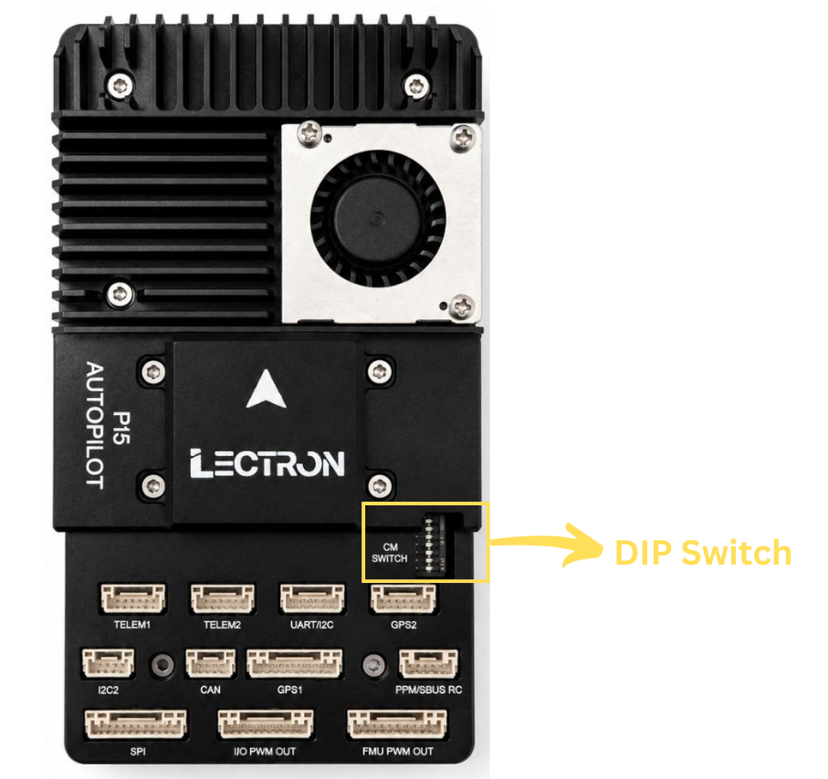

# Connections & Ports

This page describes every external connector on the **Lectron CM5 Autopilot** baseboard, including its connector type, pin assignment, signal name and operating voltage.

The board is organized into two functional domains:

- **Pixhawk FMU side** — the flight-controller connectors that follow the Pixhawk Bus Standard (CAN, SBUS, telemetry, GPS, PWM, debug, etc.).
- **CM5 compute side** — the Raspberry Pi Compute Module 5 connectors (GPIO/SPI/PWM, UART, I2C, camera FPC, CAN, USB, etc.).

!!! note "Voltage Legend"
    All logic signals are **+3.3V** unless noted otherwise.

    | Symbol | Meaning |
    | :----: | :------ |
    | `+5V` | Peripheral / system 5V rail |
    | `+3.3V` | Logic-level signal (3.3V) |
    | `+12/28V` | Main power input range |
    | `0-16V` | Servo rail sense (depends on BEC) |
    | `GND` | Ground |
    | `---` | Not connected / no defined level |

!!! danger "Warning"
    Most logic pins are **3.3V tolerant only**. Do **not** apply 5V logic levels to signal pins, and never source servo/motor power from the peripheral 5V rail.

!!! warning "Power Budget"
    The peripheral 5V rail is shared across all connectors on each side. The **total current** drawn from all **FMU ports** combined must not exceed **1.5 A**. The same **1.5 A** total limit applies to all **CM5 ports** combined. Budget the current across connected peripherals accordingly.

---

## **Pin 1 Identification**

In every pinout table below, **Pin 1** is the first row. Use the image below to locate Pin 1 on the physical JST GH connector before wiring.

{ width="420" }

---

## **FMU Connectors**

### **CAN**
Primary CAN bus for the flight controller (**BM04B-GHS**).

| Pin | Signal | Voltage |
| :-: | :----- | :-----: |
|  1  | PERIPHERAL 5V  | +5V  |
|  2  | CAN HIGH  | +3.3V  |
|  3  | CAN LOW  | +3.3V  |
|  4  | GROUND  | GND  |

### **SBUS**
RC receiver input (PPM/SBUS) with RSSI feedback (**BM05B-GHS**).

| Pin | Signal | Voltage |
| :-: | :----- | :-----: |
|  1  | PERIPHERAL 5V  | +5V  |
|  2  | PPM / SBUS INPUT  | +3.3V  |
|  3  | NC  | ---  |
|  4  | RSSI IN / SBUS OUT  | +3.3V  |
|  5  | GROUND  | GND  |

!!! warning "DSM Support"
    The Lectron PI5 Autopilot product doesn't support DSM.

### **I2C3 / UART4**
Combined serial + I2C peripheral port (**BM06B-GHS**).

| Pin | Signal | Voltage |
| :-: | :----- | :-----: |
|  1  | PERIPHERAL 5V  | +5V  |
|  2  | UART4 TX  | +3.3V  |
|  3  | UART4 RX  | +3.3V  |
|  4  | I2C3 SCL  | +3.3V  |
|  5  | I2C3 SDA  | +3.3V  |
|  6  | GROUND  | GND  |

### **SPI6**
External high-speed SPI bus with two chip-selects and two data-ready lines (**BM11B-GHS**).

| Pin | Signal | Voltage |
| :-: | :----- | :-----: |
|  1  | PERIPHERAL 5V  | +5V  |
|  2  | SPI6 SCK  | +3.3V  |
|  3  | SPI6 MISO (RX)  | +3.3V  |
|  4  | SPI6 MOSI (TX)  | +3.3V  |
|  5  | SPI6 NCS-1  | +3.3V  |
|  6  | SPI6 NCS-2  | +3.3V  |
|  7  | SPIX SYNC   | +3.3V  |
|  8  | SPI6 DRDY-1  | +3.3V  |
|  9  | SPI6 DRDY-2  | +3.3V  |
|  10  | SPI6 NRST  | +3.3V  |
|  11  | GROUND  | GND  |

### **IO PWM (MAIN)**
Main PWM outputs driven by the IO co-processor (**BM10B-GHS**).

| Pin | Signal | Voltage |
| :-: | :----- | :-----: |
|  1  | VDD SERVO SENS  | 0-16V  |
|  2  | IO PWM CH1  | +3.3V  |
|  3  | IO PWM CH2  | +3.3V  |
|  4  | IO PWM CH3  | +3.3V  |
|  5  | IO PWM CH4  | +3.3V  |
|  6  | IO PWM CH5  | +3.3V  |
|  7  | IO PWM CH6  | +3.3V  |
|  8  | IO PWM CH7  | +3.3V  |
|  9  | IO PWM CH8  | +3.3V  |
|  10  | GROUND  | GND  |

### **FMU PWM (AUX)**
Auxiliary PWM outputs driven directly by the FMU (**BM10B-GHS**).

| Pin | Signal | Voltage |
| :-: | :----- | :-----: |
|  1  | VDD SERVO SENS  | 0-16V  |
|  2  | FMU PWM CH1  | +3.3V  |
|  3  | FMU PWM CH2  | +3.3V  |
|  4  | FMU PWM CH3  | +3.3V  |
|  5  | FMU PWM CH4  | +3.3V  |
|  6  | FMU PWM CH5  | +3.3V  |
|  7  | FMU PWM CH6  | +3.3V  |
|  8  | FMU PWM CH7  | +3.3V  |
|  9  | FMU PWM CH8  | +3.3V  |
|  10  | GROUND  | GND  |

### **FMU Debug**
SWD + serial debug for the FMU processor (**SM10B-SRSS**).

| Pin | Signal | Voltage |
| :-: | :----- | :-----: |
|  1  | FMU VDD 3.3V  | +3.3V  |
|  2  | USART3_TX_DEBUG  | +3.3V  |
|  3  | USART3_RX_DEBUG  | +3.3V  |
|  4  | FMU_SWDIO  | +3.3V  |
|  5  | FMU_SWCLK  | +3.3V  |
|  6  | SPI6_SCK_EXTERNAL1  | +3.3V  |
|  7  | NFC_GPIO  | +3.3V  |
|  8  | PH11  | +3.3V  |
|  9  | FMU_NRST  | +3.3V  |
|  10  | GROUND  | GND  |

### **IO Debug**
SWD + serial debug for the IO co-processor (**SM10B-SRSS**).

| Pin | Signal | Voltage |
| :-: | :----- | :-----: |
|  1  | IO VDD 3.3V  | +3.3V  |
|  2  | IO_USART1_TX_DEBUG  | +3.3V  |
|  3  | NC  | ---  |
|  4  | IO_SWDIO  | +3.3V  |
|  5  | IO_SWCLK  | +3.3V  |
|  6  | IO_SWO  | +3.3V  |
|  7  | IO_SPARE_GPIO1  | +3.3V  |
|  8  | IO_SPARE_GPIO2  | +3.3V  |
|  9  | IO_NRST  | +3.3V  |
|  10  | GROUND  | GND  |

### **I2C2**
Secondary I2C peripheral bus (**BM04B-GHS**).

| Pin | Signal | Voltage |
| :-: | :----- | :-----: |
|  1  | PERIPHERAL 5V  | +5V  |
|  2  | I2C2 SCL  | +3.3V  |
|  3  | I2C2 SDA  | +3.3V  |
|  4  | GROUND  | GND  |

### **Telemetry 1**
Primary telemetry serial port with flow control (UART7) (**BM06B-GHS**).

| Pin | Signal | Voltage |
| :-: | :----- | :-----: |
|  1  | PERIPHERAL 5V  | +5V  |
|  2  | UART7 TX  | +3.3V  |
|  3  | UART7 RX  | +3.3V  |
|  4  | UART7 CTS  | +3.3V  |
|  5  | UART7 RTS  | +3.3V  |
|  6  | GROUND  | GND  |

### **Telemetry 2**
Secondary telemetry serial port with flow control (UART5) (**BM06B-GHS**).

| Pin | Signal | Voltage |
| :-: | :----- | :-----: |
|  1  | PERIPHERAL 5V  | +5V  |
|  2  | UART5 TX  | +3.3V  |
|  3  | UART5 RX  | +3.3V  |
|  4  | UART5 CTS  | +3.3V  |
|  5  | UART5 RTS  | +3.3V  |
|  6  | GROUND  | GND  |

### **GPS-1 (FULL)**
Full GPS port with safety switch, LED and buzzer outputs (**BM10B-GHS**).

| Pin | Signal | Voltage |
| :-: | :----- | :-----: |
|  1  | PERIPHERAL 5V  | +5V  |
|  2  | USART1 TX  | +3.3V  |
|  3  | USART2 RX  | +3.3V  |
|  4  | I2C1 SCL  | +3.3V  |
|  5  | I2C1 SDA  | +3.3V  |
|  6  | SAFETY SWITCH IN  | +3.3V  |
|  7  | SAFETY LED OUT  | +3.3V  |
|  8  | FMU 3.3V  | +3.3V  |
|  9  | BUZZER-   | +3.3V  |
|  10  | GROUND  | GND  |

### **GPS-2 (BASIC)**
Secondary GPS port (serial + I2C only) (**BM06B-GHS**).

| Pin | Signal | Voltage |
| :-: | :----- | :-----: |
|  1  | PERIPHERAL 5V  | +5V  |
|  2  | UART8 TX  | +3.3V  |
|  3  | UART8 RX  | +3.3V  |
|  4  | I2C2 SCL  | +3.3V  |
|  5  | I2C2 SDA  | +3.3V  |
|  6  | GROUND  | GND  |

### **Ethernet**
100BASE-T differential pairs for FMU networking (**BM04B-GHS**).

| Pin | Signal | Voltage |
| :-: | :----- | :-----: |
|  1  | ETH TX-N  | ---  |
|  2  | ETH TX-P  | ---  |
|  3  | ETH RX-N  | ---  |
|  4  | ETH RX-P  | ---  |

### **External Power Monitoring**
External power module / smart-battery monitoring (I2C1) (**BM04B-GHS**).

| Pin | Signal | Voltage |
| :-: | :----- | :-----: |
|  1  | SYSTEM 5V  | +5V  |
|  2  | I2C1 SCL  | +3.3V  |
|  3  | I2C1 SDA  | +3.3V  |
|  4  | GROUND  | GND  |

!!! note "Onboard Power Monitoring"
    The board includes an onboard voltage-sensing module (**INA238**). To also measure current draw or monitor an external battery, connect a compatible I2C power module to this port.

### **USB**
USB 2.0 Type-C for firmware flashing and MAVLink over USB (**USB 2.0 Type-C**).

| Pin | Signal | Voltage |
| :-: | :----- | :-----: |
|  -  | -  | +5V  |

### **SD Card**
MicroSD slot for FMU logging (**TF SD Card**).

| Pin | Signal | Voltage |
| :-: | :----- | :-----: |
|  -  | -  | +3.3V  |

---

## **CM5 Connectors**

### **GPIO – SPI / PWM**
SPI1 bus plus four PWM channels exposed from the Compute Module (**SM10B-GHS**).

| Pin | Signal | Voltage |
| :-: | :----- | :-----: |
|  1  | SYSTEM 5V  | +5V  |
|  2  | CM5 SPI1 SCLK  | +3.3V  |
|  3  | CM5 SPI1 SIO1 (MISO)  | +3.3V  |
|  4  | CM5 SPI1 SIO0 (MOSI)  | +3.3V  |
|  5  | CM5 SPI1 CS1  | +3.3V  |
|  6  | CM5 PWM CH1  | +3.3V  |
|  7  | CM5 PWM CH2  | +3.3V  |
|  8  | CM5 PWM CH3  | +3.3V  |
|  9  | CM5 PWM CH4  | +3.3V  |
|  10  | GROUND  | GND  |

### **GPIO / UART**
General-purpose GPIO header with UART2 (**SM10B-GHS**).

| Pin | Signal | Voltage |
| :-: | :----- | :-----: |
|  1  | SYSTEM 5V  | +5V  |
|  2  | CM5 GPIO22  | +3.3V  |
|  3  | CM5 GPIO23  | +3.3V  |
|  4  | CM5 GPIO24  | +3.3V  |
|  5  | CM5 GPIO25  | +3.3V  |
|  6  | CM5 GPIO26  | +3.3V  |
|  7  | CM5 GPIO27  | +3.3V  |
|  8  | CM5 UART2 TX  | +3.3V  |
|  9  | CM5 UART2 RX  | +3.3V  |
|  10  | GROUND  | GND  |

### **I2C1 / I2C3**
Two CM5 I2C buses on a single connector (**SM06B-GHS**).

| Pin | Signal | Voltage |
| :-: | :----- | :-----: |
|  1  | SYSTEM 5V  | +5V  |
|  2  | CM5 I2C1 SCL  | +3.3V  |
|  3  | CM5 I2C1 SDA  | +3.3V  |
|  4  | CM5 I2C3 SCL  | +3.3V  |
|  5  | CM5 I2C3 SDA  | +3.3V  |
|  6  | GROUND  | GND  |

### **CAN (SPI Interfaced)**
CAN bus via an MCP2515 controller on SPI1-CS0 (**SM04B-GHS**).

| Pin | Signal | Voltage |
| :-: | :----- | :-----: |
|  1  | SYSTEM 5V  | +5V  |
|  2  | CAN HIGH  | +3.3V  |
|  3  | CAN LOW  | +3.3V  |
|  4  | GROUND  | GND  |

### **FAN**
PWM-controlled cooling fan with tachometer feedback (**SM04B-SRSS**).

| Pin | Signal | Voltage |
| :-: | :----- | :-----: |
|  1  | SYSTEM 5V  | +5V  |
|  2  | FAN PWM  | +3.3V  |
|  3  | GND  | GND  |
|  4  | FAN TACHO  | +3.3V  |

### **FPC1 — Camera / Display 0**
22-pin 0.5mm-pitch FPC carrying MIPI port 0 (4-lane) (**22-pin FPC (0.5mm)**).

| Pin | Signal | Voltage |
| :-: | :----- | :-----: |
|  1  | GROUND  | GND  |
|  2  | MIPI0_D0_N  | +3.3V  |
|  3  | MIPI0_D0_P  | +3.3V  |
|  4  | GROUND  | GND  |
|  5  | MIPI0_D1_N  | +3.3V  |
|  6  | MIPI0_D1_P  | +3.3V  |
|  7  | GROUND  | GND  |
|  8  | MIPI0_C_N  | +3.3V  |
|  9  | MIPI0_C_P  | +3.3V  |
|  10  | GROUND  | GND  |
|  11  | MIPI0_D2_N  | +3.3V  |
|  12  | MIPI0_D2_P  | +3.3V  |
|  13  | GROUND  | GND  |
|  14  | MIPI0_D3_N  | +3.3V  |
|  15  | MIPI0_D3_P  | +3.3V  |
|  16  | GROUND  | GND  |
|  17  | CAM_GPIO0  | +3.3V  |
|  18  | CAM_GPIO1  | +3.3V  |
|  19  | GROUND  | GND  |
|  20  | CM5_SCL0  | +3.3V  |
|  21  | CM5_SDA0  | +3.3V  |
|  22  | CM5 3.3V  | +3.3V  |

### **FPC2 — Camera / Display 1**
22-pin 0.5mm-pitch FPC carrying MIPI port 1 (4-lane) (**22-pin FPC (0.5mm)**).

| Pin | Signal | Voltage |
| :-: | :----- | :-----: |
|  1  | GROUND  | GND  |
|  2  | MIPI1_D0_N  | +3.3V  |
|  3  | MIPI1_D0_P  | +3.3V  |
|  4  | GROUND  | GND  |
|  5  | MIPI1_D1_N  | +3.3V  |
|  6  | MIPI1_D1_P  | +3.3V  |
|  7  | GROUND  | GND  |
|  8  | MIPI1_C_N  | +3.3V  |
|  9  | MIPI1_C_P  | +3.3V  |
|  10  | GROUND  | GND  |
|  11  | MIPI1_D2_N  | +3.3V  |
|  12  | MIPI1_D2_P  | +3.3V  |
|  13  | GROUND  | GND  |
|  14  | MIPI1_D3_N  | +3.3V  |
|  15  | MIPI1_D3_P  | +3.3V  |
|  16  | GROUND  | GND  |
|  17  | CM5 3.3V  | +3.3V  |
|  18  | NC  | ---  |
|  19  | GROUND  | GND  |
|  20  | CM5 ID-SC  | +3.3V  |
|  21  | CM5 ID-SD  | +3.3V  |
|  22  | CM5 3.3V  | +3.3V  |

### **M.2 Key**
M.2 M-Key 2230 or 2242 slot (PCIe / NVMe storage) (**M.2 M-Key**).

| Pin | Signal | Voltage |
| :-: | :----- | :-----: |
|  -  | -  | +3.3V  |

### **HDMI**
Micro-HDMI video output (**Micro HDMI**).

| Pin | Signal | Voltage |
| :-: | :----- | :-----: |
|  -  | -  | +5V  |

### **USB 3.0 (Port A)**
USB 3.0 Type-C host port (**USB Type-C**).

| Pin | Signal | Voltage |
| :-: | :----- | :-----: |
|  -  | -  | +5V  |

### **USB 3.0 (Port B)**
USB 3.0 Type-C host port (**USB Type-C**).

| Pin | Signal | Voltage |
| :-: | :----- | :-----: |
|  -  | -  | +5V  |

### **USB 2.0**
USB 2.0 Micro port (**USB Micro**).

| Pin | Signal | Voltage |
| :-: | :----- | :-----: |
|  -  | -  | +5V  |

### **SD Card**
MicroSD slot for the Compute Module (**TF SD Card**).

| Pin | Signal | Voltage |
| :-: | :----- | :-----: |
|  -  | -  | +3.3V  |

---

## **DIP Switch (CM Switch)**

The 8-position DIP switch (labelled **CM SWITCH**) configures CM5 boot and interface options.

{ width="320" }

!!! note "Switch State"
    When the switches are toggled toward the **"CM SWITCH"** text (as shown above), they are in the **PASSIVE/DEFAULT** state.

| # | Function |
| :-: | :------- |
| 1 | WiFi Disable (active low) |
| 2 | Bluetooth Disable (active low) |
| 3 | RPi Boot (eMMC boot disable) |
| 4 | EEPROM Write Protect (active low) |
| 5 | Ethernet Sync Out |
| 6 | USB OTG ID |
| 7 | PMIC Enable |
| 8 | Power Button |

---

## **Power Input**

### **Power Input (XT30)**
Main board power input (**XT30**).

| Pin | Signal | Voltage |
| :-: | :----- | :-----: |
|  1  | 12-28V  | +12/28V  |
|  2  | GROUND  | GND  |

!!! danger "Reverse Polarity"
    Observe correct polarity on the XT30 input. Input voltage must stay within **+12V to +28V**; reverse polarity or over-voltage may permanently damage the board.

!!! danger "Use the Supplied XT30 Cable Only"
    Power the board exclusively through the **XT30 cable supplied by Lectron**. Using a third-party or incorrectly wired cable may damage the onboard regulator stage. This cable compansate voltage ripples that are caused by motors.

---

!!! info "Reference"
    Connector layout follows the **Pixhawk Bus Standard** on the FMU side.