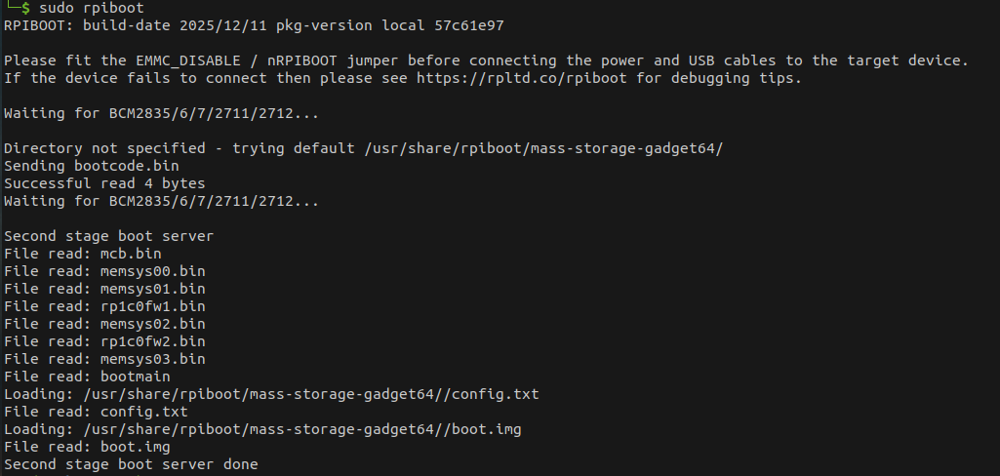
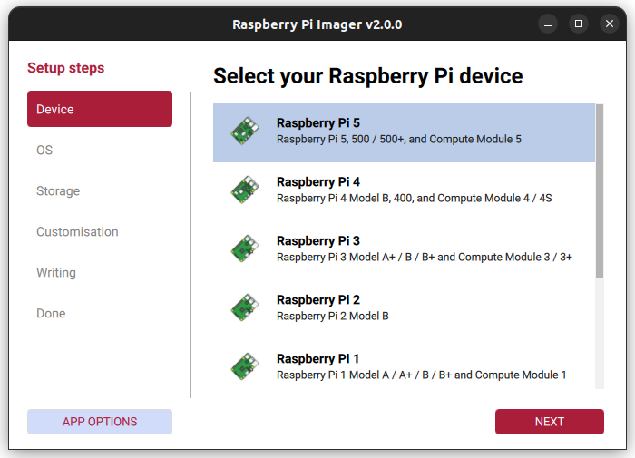
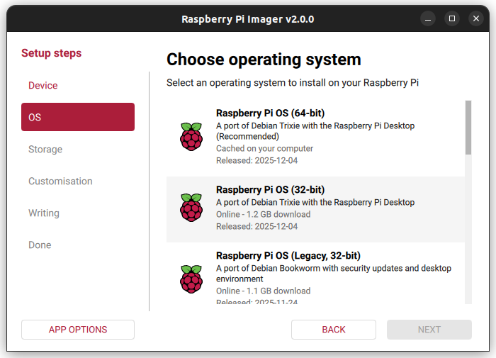
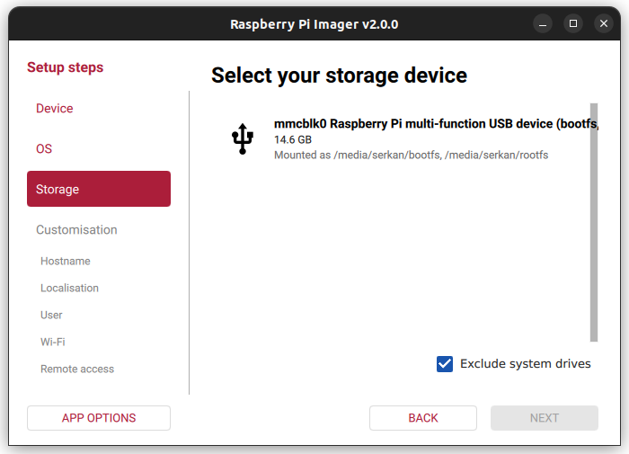

# Setup

To flash the eMMC on a Raspberry Pi Compute Module, the following components are required:

- **Host device:** A computer running Linux, Windows, or macOS
- Micro USB cable
- Raspberry Pi Compute Module with a compatible carrier board

## **Set up the Board**

- To **disable eMMC boot** on the Raspberry Pi: Set the **nRPI_BOOT** pin to HIGH using the **8-pin DIP** switch on the board
**(typically the 3rd switch)**.
- Connect the board to the host device using a Micro USB cable.

## **Set up the Host Device**

!!! note "Note"

	The steps below follow the official Raspberry Pi documentation without modification.
	Reference: [Raspberry Pi – eMMC flashing documentation](https://www.raspberrypi.com/documentation/computers/compute-module.html)

=== "Linux"
	1. Install the rpiboot tool (or build it [from source](https://github.com/raspberrypi/usbboot)): `sudo apt install rpiboot`
	2. Connect the IO Board to power.
	3. Run rpiboot:	`sudo rpiboot`
	4. After a few seconds, the Compute Module will appear as a USB mass storage device.
		- Check `/dev/` (commonly `/dev/sda` or `/dev/sdb`)
		- Alternatively, run lsblk and identify the device matching the module’s storage size.

=== "Windows"
	1. Download the [Windows installer](https://github.com/raspberrypi/usbboot/raw/master/win32/rpiboot_setup.exe) for rpiboot or build it [from source](https://github.com/raspberrypi/usbboot).
	2. Run the installer. **(Do not close any driver installation windows during setup.)**
	3. Reboot the system.
	4. Connect the IO Board to power. Windows will automatically detect the hardware and install required drivers.
	5. For CM4 and newer devices:
		- Select **“Raspberry Pi – Mass Storage Gadget – 64-bit”** from the Start Menu.
		- The eMMC or NVMe device will appear as a USB mass storage device.
		- A serial debug console is also exposed.
	6. For CM3 and older devices:
		- Run **RPiBoot.exe**.
		- The Compute Module eMMC will appear as a USB mass storage device.

=== "MacOS"
	1. Build rpiboot [from source.](https://github.com/raspberrypi/usbboot)
	2. Connect the IO Board to power.
	3. Run the rpiboot executable from the terminal: `rpiboot -d mass-storage-gadget64`
	4. When prompted with **“The disk you inserted was not readable by this computer.”** Click **Ignore**.
	5. The Compute Module eMMC will now appear as a USB mass storage device.

!!! tip "rpiboot"
	The output of the `sudo rpiboot` command should appear as expected.  If it remains stuck at `Waiting for BCM2835/6/7/2711/2712...`, 
	install **rpiboot** [from source.](https://github.com/raspberrypi/usbboot).

	

## **Raspberry Pi Imager**

- Launch the Raspberry Pi Imager application.
- Select Raspberry Pi 5 as the target board.

- Choose the operating system; **Raspberry Pi OS (64-bit)** is recommended.

- As the storage device, select the Raspberry Pi eMMC detected by your computer.

- In the advanced settings section, configure: Username, Hostname, Wi-Fi credentials, SSH access

- Start the flashing process by clicking `Write` and wait until it completes.

!!! danger "Note"
	- After the installation is completed, make sure to set **pin 3** on the 8-pin DIP switch back to the **LOW** state.
	- Before performing this step, power off the device.
	- Disconnect the Micro USB cable.
	- Set pin 3 of the DIP switch to the **LOW** position.
	- Finally, reconnect the power supply to restart the system.