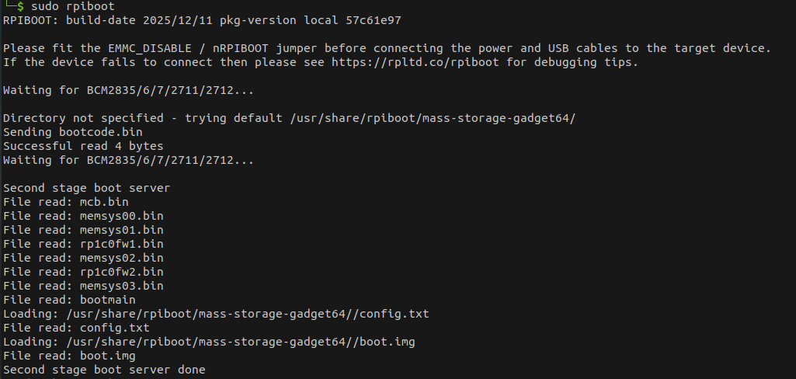
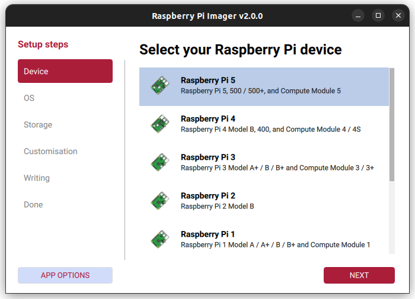
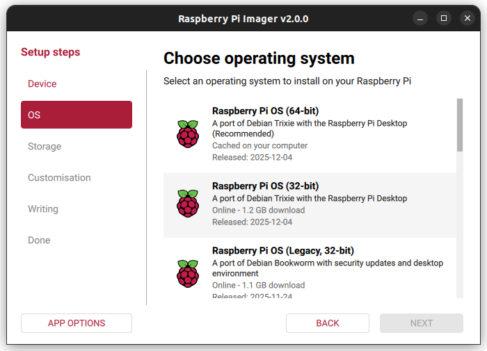
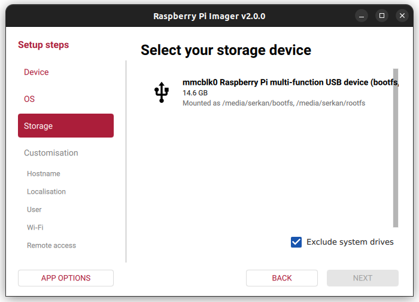
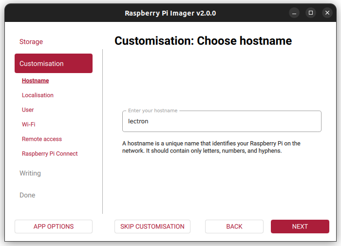
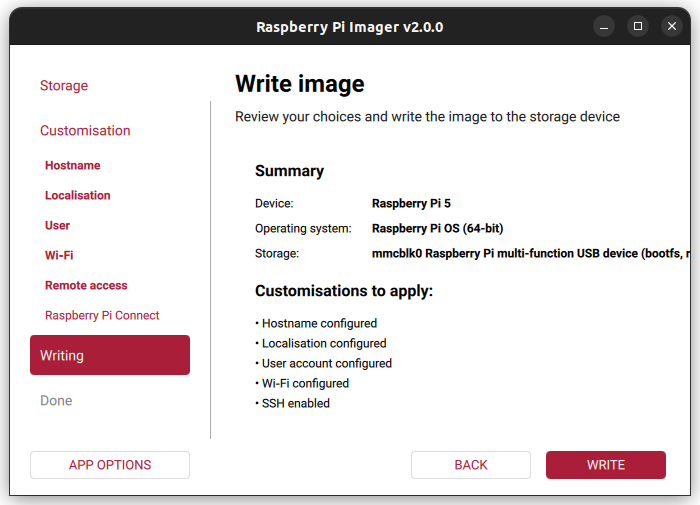
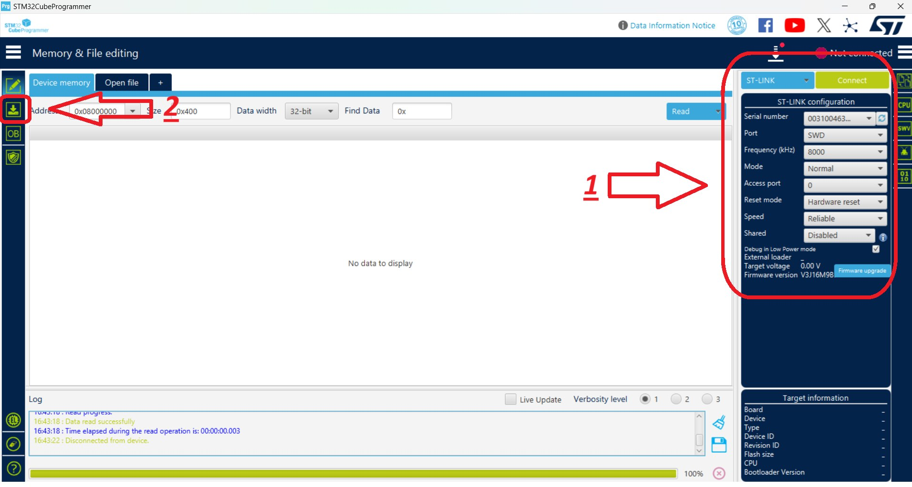
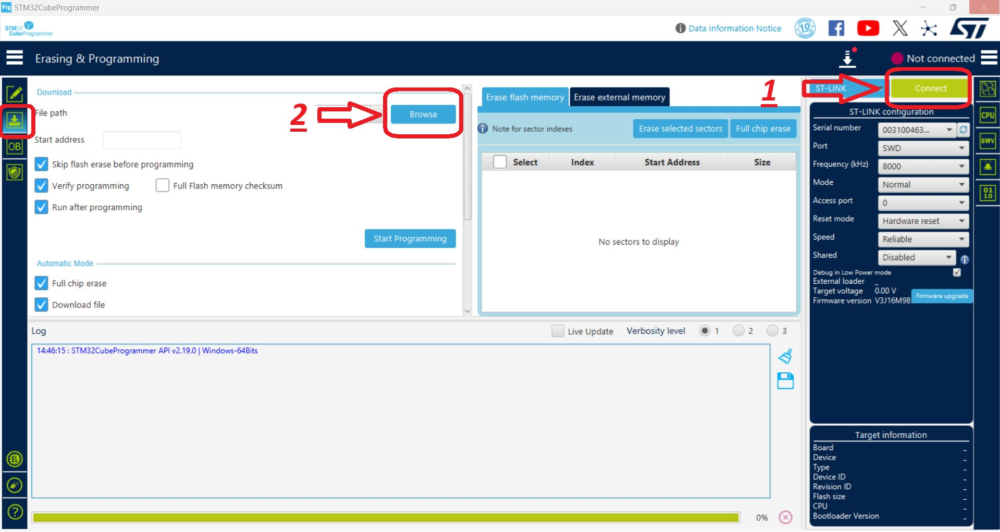
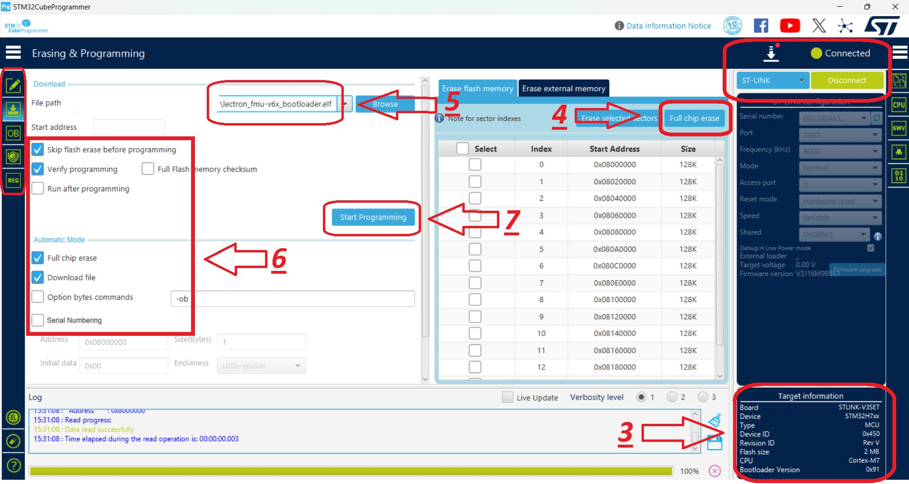
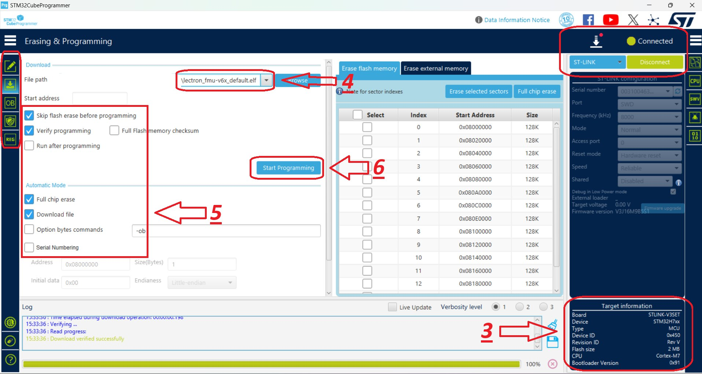

# Initial Installation

To flash the eMMC on a Raspberry Pi Compute Module, the following components are required:

- **Host device:** A computer running Linux, Windows, or macOS
- Micro USB cable
- Raspberry Pi Compute Module with a compatible carrier board

## **Set up the Board**

- To **disable eMMC boot** on the Raspberry Pi: Set the **nRPI_BOOT** pin to HIGH using the **8-pin DIP** switch on the board
**(typically the 3rd switch)**.
- Connect the board to the host device using a Micro USB cable.

## **Set up the Host Device**

!!! note "Note"

	The steps below follow the official Raspberry Pi documentation without modification.
	Reference: [Raspberry Pi – eMMC flashing documentation](https://www.raspberrypi.com/documentation/computers/compute-module.html)

=== "Linux"
	1. Install the rpiboot tool (or build it [from source](https://github.com/raspberrypi/usbboot)): `sudo apt install rpiboot`
	2. Connect the IO Board to power.
	3. Run rpiboot:	`sudo rpiboot`
	4. After a few seconds, the Compute Module will appear as a USB mass storage device.
		- Check `/dev/` (commonly `/dev/sda` or `/dev/sdb`)
		- Alternatively, run lsblk and identify the device matching the module’s storage size.

=== "Windows"
	1. Download the [Windows installer](https://github.com/raspberrypi/usbboot/raw/master/win32/rpiboot_setup.exe) for rpiboot or build it [from source](https://github.com/raspberrypi/usbboot).
	2. Run the installer. **(Do not close any driver installation windows during setup.)**
	3. Reboot the system.
	4. Connect the IO Board to power. Windows will automatically detect the hardware and install required drivers.
	5. For CM4 and newer devices:
		- Select **“Raspberry Pi – Mass Storage Gadget – 64-bit”** from the Start Menu.
		- The eMMC or NVMe device will appear as a USB mass storage device.
		- A serial debug console is also exposed.
	6. For CM3 and older devices:
		- Run **RPiBoot.exe**.
		- The Compute Module eMMC will appear as a USB mass storage device.

=== "MacOS"
	1. Build rpiboot [from source.](https://github.com/raspberrypi/usbboot)
	2. Connect the IO Board to power.
	3. Run the rpiboot executable from the terminal: `rpiboot -d mass-storage-gadget64`
	4. When prompted with **“The disk you inserted was not readable by this computer.”** Click **Ignore**.
	5. The Compute Module eMMC will now appear as a USB mass storage device.

!!! tip "rpiboot"
	The output of the `sudo rpiboot` command should appear as expected.  If it remains stuck at `Waiting for BCM2835/6/7/2711/2712...`, 
	install **rpiboot** [from source.](https://github.com/raspberrypi/usbboot).

	


## **Raspberry Pi Imager**

- Launch the Raspberry Pi Imager application.
- Select Raspberry Pi 5 as the target board.



- Choose the operating system; **Raspberry Pi OS (64-bit)** is recommended.



- As the storage device, select the Raspberry Pi eMMC detected by your computer.



- In the advanced settings section, configure: Username, Hostname, Wi-Fi credentials, SSH access



- Start the flashing process by clicking `Write` and wait until it completes.



!!! danger "Note"
	- After the installation is completed, make sure to set **pin 3** on the 8-pin DIP switch back to the **LOW** state.
	- Before performing this step, power off the device.
	- Disconnect the Micro USB cable.
	- Set pin 3 of the DIP switch to the **LOW** position.
	- Finally, reconnect the power supply to restart the system.


## **FMU Firmware Installation**

This section contains step-by-step instructions for flashing the bootloader and firmware onto the **FMU IO (F103)** and **FMU MAIN (H753)** chips using **STM32CubeProgrammer**.

!!! danger "Wiring — Before You Start"
	Before the flashing process, make sure the debug cable and the ST-Link / CubeProgrammer pins are connected correctly:

	```text
	SWDIO   >>> SWDIO
	SWDCLK  >>> SWDCLK
	GND     >>> GND
	NRST    >>> NRST
	```

	The Autopilot board must be powered (via **USB** or **XT30**) before performing these steps.

!!! note "ArduPilot vs. PX4"
	The FMU bootloader and FMU firmware files differ depending on the autopilot software (**ArduPilot** or **PX4**). The flashing procedure remains the same — only the target files change.

### **Connection Settings**
Select the connection settings on the right-hand panel as shown below, then use the **Connect** button. After connecting, the target chip is shown in the **bottom-right corner** (`STM32F10x` for the IO chip, `STM32H7` for the FMU chip).



### **1. IO Chip Flashing (F103)**

**Hardware Connections**

1. Connect the debug cable (10-pin GHS-10) to the IO debug port.
2. Connect the ST-Link to the computer.

**STM32CubeProgrammer Steps**

1. Launch **STM32CubeProgrammer**. Select the connection settings on the right panel and click **Connect**.
2. Switch to the programming panel using the left-hand toolbar.
3. After the ST-Link connects, verify that **STM32F10x** is displayed in the bottom-right corner.
4. Click **Full chip erase** to wipe any existing code. In the confirmation pop-up (*"Are you sure you want to erase full chip flash memory"*), click **OK**.
5. Select the provided **IO bootloader** file.
6. Check the programming configuration options as indicated in the reference layout.
7. Click **Start Programming**.



8. Once complete, dismiss the *"Download verified successfully"* and *"File download complete"* alerts by clicking **OK**.
9. The **IO installation is complete**.
10. For safety, disconnect from the hardware by clicking **Disconnect** (which replaces the *Connect* button).

### **2. FMU Chip Flashing (H753)**

This stage installs the **Bootloader** first, followed by the **FMU Firmware**.

**Hardware Connections**

1. Connect the debug cable (10-pin GHS-10) to the FMU debug port.
2. Connect the ST-Link to the computer.

#### **FMU Bootloader Flashing**

1. Launch **STM32CubeProgrammer** and click **Connect** (top-right).
2. Switch to the programming panel using the left-hand toolbar.
3. After the ST-Link connects, verify that **STM32H7** is displayed in the bottom-right corner.
4. Click **Full chip erase** to wipe any existing code, then click **OK** on the confirmation pop-up.
5. Select the provided **FMU Bootloader** file.
6. Check the installation options as indicated in the reference layout.
7. Click **Start Programming**.



8. Once complete, close the *"Download verified successfully"* and *"File download complete"* prompts by clicking **OK**.
9. The **FMU Bootloader installation is complete**.
10. For safety, click **Disconnect** (top-right).

#### **FMU Firmware Flashing**

1. Launch **STM32CubeProgrammer** and click **Connect** (top-right).
2. Switch to the programming panel using the left-hand toolbar.
3. Ensure that **STM32H7** is displayed in the bottom-right corner as the target chip.
4. Select the provided **FMU Firmware** file.
5. Check the programming options as shown in the reference image.

	!!! danger "CRITICAL"
		Uncheck the **Full chip erase** box to prevent wiping the bootloader you just installed.

6. Click **Start Programming** to begin flashing the firmware.



7. When the operation completes, confirm and close the *"Download verified successfully"* and *"File download complete"* alerts by clicking **OK**.
8. The **FMU Firmware installation is complete**.