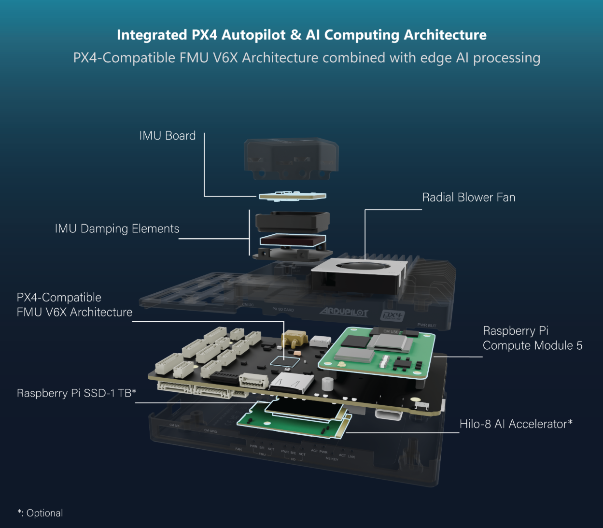

# Specification

## CM5 & System Support

| Feature | Description |
|-------|---------------|
| Power Input                 | 7V – 28V (3S-6S LiPo), XT30 Connector |
| Overcurrent Protection      | 5A Maximum |
| Power Monitor               | Internal Voltage & external I2C Current Monitor |
| Supported Raspberry Modules | Compute Module 5 |
| Camera Interface            | 2 × 22-Pin, 0.5 mm pitch CSI |
| PCIe                        | M.2 Key-M 2230 & 2242 slot (PCIe Gen2 x1) |
| USB                         | 2 × USB 3.0 Type-C, Micro USB 2.0 (host) |
| Ethernet                    | 1 × 8-Pin, 1 Gbps |
| GPIO                        | 6-Pin |
| HDMI Output                 | Mini HDMI | 
| I2C                         | 2 -> I2C1 / I2C3 |
| UART                        | 1 -> UART2 |
| SPI                         | CAN      -> SPI1_CS0 |
|                             | External -> SPI1_CS1 |
|                             | BMI270   -> (SPI1_CS2) |
| FMU ↔ CM5 Communication     | FMU USART2 (TELEM3) ↔ UART3 (CM5) |
| Cooling                     | Active and Passive |

## FMU System Support

| Feature | Description |
|-------|---------------|
| Supported Firmware   | ArduPilot, PX4 |
| Power Regulation     | 5V rail, shared 5V bus with CM5 (no separate regulation) |
| Power Distribution   | Onboard regulated |
| FMU Processor        | STM32H753IIK6TR (32-bit Arm® Cortex®-M7, 480MHz, 2MB flash memory, 1MB RAM) |
| IO Processor         | STM32F103 (32 Bit Arm® Cortex®-M3, 72MHz, 64KB SRAM) |
| FMU Status LEDs          | 3x LEDs (Red, Green, Blue) | 
| IO Status LEDs          | 3x LEDs (Blue, Amber, Green) |
| Cooling              | No active cooling |
| TELEM                | TELEM1 (UART7) |
|                      | TELEM2 (UART5) |
| GPS                  | Full 10-pin JST-GH (UART1, I2C1, 5V Out) |
|                      | Basic 6-pin JST-GH (UART8, I2C2, 5V Out) |
| USB                  | USB Type-C 5V |
| SD Card              | MicroSD SDMMC interface |
| CAN                  | 1 |
| I2C                  | I2C2 / I2C3 |
| UART                 |  UART4 |
| External SPI         | 11-pin JST-GH (SPI6, 2x CS, 2x DRDY, RESET) |
| RC / SBUS            | PPM, S.BUS (5-pin JST-GH) |
| PWM Outputs          | 8 Channels FMU + 8 Channels IO (10-pin JST-GH) |
| Ethernet             | 4-pin JST-GH (LAN8742AI PHY) |
| FMU/IO Debug Interface | SWD (10-pin JST-SH)  |
| CM5 Link          | UART or Ethernet |
| FMU Onboard Sensors  | IMU: ICM-42670-P (SPI), Barometer: BMP390 (I2C), FRAM: FM25V02A, EEPROM: AT24C02D |
| Sensor Board         | IMU1: BMI270 (SPI), IMU2: ICM-42670-P (SPI), Barometer: BMP390 (I2C), Magnetometer: BMM350 (I2C), EEPROM: 24LC64T |

